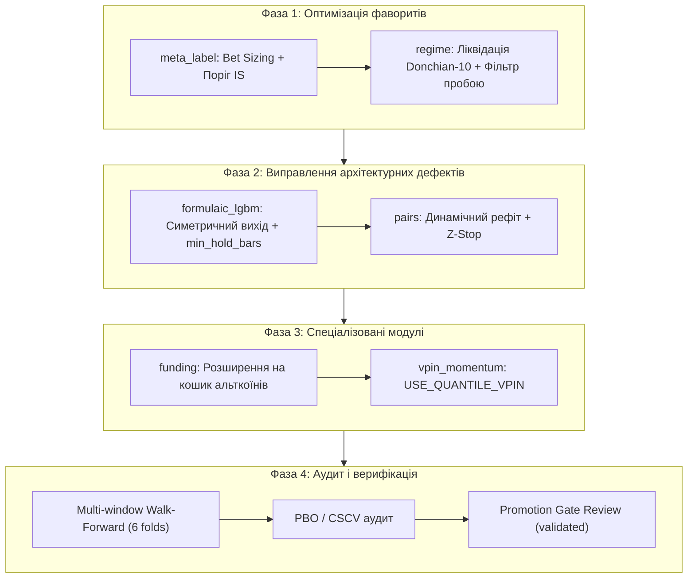

# План покращення торгових стратегій nautilus-lab

> **Контекст розробки:** План базується на результатах аудиту батчу [`20261002_153930_batch`](file:///home/volodymyr/PycharmProjects/nautilus-lab/reports/batches/20261002_153930_batch) (1000 днів, 6 rolling walk-forward фолдів).  
> **Головна мета:** Доведення щонайменше однієї стратегії до статусу `validated` з випередженням `Buy&Hold` на Out-Of-Sample (`mean_excess > 0`), проходженням промоційного гейту ($\ge 4/6$ прибуткових фолдів) та стійкістю до taker-комісій (7.5 bps).  
> **Базовий принцип проєкту:** **Spec-Driven Development** (специфікація в `specs/strategies/<robot>.yaml` оновлюється та перевіряється валідатором **до** внесення змін у код).



---

## Фаза 1: Оптимізація та масштабування фаворитів (Найвищий пріоритет)

Стратегії `meta_label` та `regime` продемонстрували стійку математичну перевагу (додатний OOS, захист у ведмежих фазах, високий Avg R). Потрібно усунути фактори, які завадили їм перевершити Buy&Hold.

### Етап 1.1. `meta_label`: Розширення ринкового exposure та динамічний Bet Sizing
* **Проблема:** Перебування в ринку лише ~5% часу. Відхилено 95% сигналів через високий фіксований поріг $P \ge 0.55$. Стратегія недоотримала прибуток під час сильних трендів, хоча показала відмінний ризик-профіль (Avg R = +0.528 на BTC, просадка найгіршого фолду лише -2.17%).
* **Задачі:**
  1. **Специфікація:** Оновити [`specs/strategies/meta_label.yaml`](file:///home/volodymyr/PycharmProjects/nautilus-lab/specs/strategies/meta_label.yaml), описавши гіпотезу розширення сітки порогів вето на In-Sample (`[0.45, 0.50, 0.55]`).
  2. **Сітка підбору:** Додати поріг `0.45` до гілки `RobotName.META_LABEL` у [`src/nautilus_lab/application/param_grid.py`](file:///home/volodymyr/PycharmProjects/nautilus-lab/src/nautilus_lab/application/param_grid.py).
  3. **Динамічний розмір позиції (Fractional Bet Sizing):** Впровадити масштабування розміру позиції за формулою Маркоса Лопеса де Прадо:  
     $$\text{Multiplier} = 2 \cdot (P - 0.50), \quad \text{при } P \ge 0.50$$  
     Це дозволить не відсікати угоди бінарно, а брати менший обсяг при помірній впевненості та збільшений обсяг при $P \ge 0.65$.
  4. **Верифікація:**
     - Валідатор спеки: `.venv/bin/python specs/_validator.py meta_label`
     - Бектест: `uv run lab research --robot meta_label --folds 6` на BTC та ETH.

---

### Етап 1.2. `regime`: Ліквідація пилкоподібних хибних пробоїв (Donchian Whipsaw)
* **Проблема:** In-Sample перенавчається на короткий канал `donchian=10`, який на 1h барах є шумом (10 годин). Це призводить до серій хибних пробоїв на локальних вершинах під час корекцій (Fold 2 BTC: 5 збиткових угод поспіль). У сильних ралі (Fold 5) робот сидить у Range 57% часу.
* **Задачі:**
  1. **Специфікація:** Оновити [`specs/strategies/regime.yaml`](file:///home/volodymyr/PycharmProjects/nautilus-lab/specs/strategies/regime.yaml), зафіксувавши нові діапазони сітки каналів та умови фільтрації.
  2. **Оновлення простору сітки:** У [`src/nautilus_lab/application/param_grid.py`](file:///home/volodymyr/PycharmProjects/nautilus-lab/src/nautilus_lab/application/param_grid.py) замінити `donchian in (10, 20, 40)` на свінгові періоди: `donchian in (24, 48, 72)` (1–3 доби).
  3. **Фільтр якості пробою:** Додати до [`UptrendBreakout`](file:///home/volodymyr/PycharmProjects/nautilus-lab/src/nautilus_lab/domain/donchian.py) / [`DowntrendBreakout`](file:///home/volodymyr/PycharmProjects/nautilus-lab/src/nautilus_lab/domain/donchian.py) вимогу імпульсу або волатильнісного буфера:
     $$\text{close} > \text{high}_{n} + k \cdot \text{ATR}(14), \quad k \in [0.1, 0.25]$$
  4. **Дослідження асиметрії крипторинку (`REGIME_LEGS`):** Прогнати A/B тест з відключенням Donchian шортів (`REGIME_LEGS=uptrend,range`), щоб усунути збитки від шорт-сквізів під час бичачих циклів.
  5. **Верифікація:**
     - `.venv/bin/python specs/_validator.py regime`
     - `uv run lab research --robot regime --folds 6`

---

## Фаза 2: Виправлення архітектурних дефектів та комісійних витоків

Стратегії `formulaic_lgbm` та `pairs` генерують сотні угод, сплачуючи величезні комісії та страждаючи від асиметрії логіки.

### Етап 2.1. `formulaic_lgbm`: Ліквідація Hyper-churning та симетризація виходу
* **Проблема:** Win Rate 60%, але результат -3.92% (BTC) та -5.59% (ETH). Робот відкрив 446–532 угоди (понад 1000 філів), оскільки в [`formulaic_lgbm_strategy.py`](file:///home/volodymyr/PycharmProjects/nautilus-lab/src/nautilus_lab/domain/formulaic_lgbm_strategy.py) вхід вимагає $P(up) \ge 0.55$, а вихід спрацьовує на першому ж барі, де випадковий шум робить $P(down) > P(up)$ навіть на 0.001. За 1000 днів сплачено ~7.5% капіталу лише брокеру на taker-комісіях.
* **Задачі:**
  1. **Специфікація:** Оновити [`specs/strategies/formulaic_lgbm.yaml`](file:///home/volodymyr/PycharmProjects/nautilus-lab/specs/strategies/formulaic_lgbm.yaml).
  2. **Симетричний поріг виходу:** У [`FormulaicLgbmStrategy.on_bar`](file:///home/volodymyr/PycharmProjects/nautilus-lab/src/nautilus_lab/domain/formulaic_lgbm_strategy.py) змінити умову виходу: закривати лонг не при $P(down) > P(up)$, а лише якщо $P(down) \ge \text{exit\_threshold}$ (де $\text{exit\_threshold} \ge 0.50$) або при спрацьовуванні стоп-лосу / трейлінгу.
  3. **Захисний бар'єр утримання (`min_hold_bars`):** Ввести мінімальний термін утримання (наприклад, 4–6 барів), щоб відсіяти мікроструктурне тремтіння й дати руху перекрити комісію 15 bps round-trip.
  4. **Верифікація:** Тест кількості філів (має впасти з 1000 до ~150–200 на 1000 днів) та повторний прогін на фолдах.

---

### Етап 2.2. `pairs`: Захист від розриву коінтеграції та адаптивний рефіт
* **Проблема:** Збиток -11.23%, 0/6 фолдів, 2232 філи! Заморожені параметри (`PAIRS_REFIT_EVERY=0`) призвели до того, що під час фундаментального спаду ETH/BTC стратегія безперервно купувала спред, вважаючи його стаціонарним.
* **Задачі:**
  1. **Специфікація:** Оновити [`specs/strategies/pairs.yaml`](file:///home/volodymyr/PycharmProjects/nautilus-lab/specs/strategies/pairs.yaml).
  2. **Динамічний рефіт:** Перевести `PAIRS_REFIT_EVERY` з `0` на ковзне вікно (наприклад, кожні 48–72 бари), щоб коефіцієнт хеджування $\beta$ та середнє $\mu$ адаптувалися до структурних зрушень ринку.
  3. **Z-Score Stop-Loss:** Додати аварійне закриття позиції при розширенні спреду понад поріг відсікання:
     $$\text{якщо } |z| \ge 3.5 \implies \text{вихід з ринку (розрив коінтеграції)}$$
  4. **Квантильний фільтр входу:** Протестувати `PAIRS_Z_ENTRY_QUANTILE` для роботи з важкими хвостами розподілу криптовалют.
  5. **Верифікація:** Зниження збитків у періоди стійких трендів ETH/BTC.

---

## Фаза 3: Спеціалізовані модулі (Funding та VPIN)

### Етап 3.1. `funding`: Розширення пулу інструментів на волатильні альткоїни
* **Проблема:** Стратегія має позитивний OOS та нульову просадку, але не пройшла гейт через брак філів (20–24 замість $\ge 50$). На зрілих спотових ринках BTC/ETH ставки фандингу у 2025–2026 роках занадто низькі для подолання бар'єра 2 taker-комісій.
* **Задачі:**
  1. Підготувати Parquet-каталоги ставок фандингу для пулу високодохідних альткоїнів (SOLUSDT, DOGEUSDT, ADAUSDT).
  2. Дослідити чутливість порогу `FUNDING_MIN_NET_APY` та часу амортизації `FUNDING_HOLDING_PERIODS`.
  3. Оновити специфікацію [`specs/strategies/funding.yaml`](file:///home/volodymyr/PycharmProjects/nautilus-lab/specs/strategies/funding.yaml) за результатами прогону на мультиактивному кошику.

### Етап 3.2. `vpin_momentum`: Перехід на QuantileVpin
* **Проблема:** Робот має 0 угод через нереалістичний поріг `VPIN_TOXIC_THRESHOLD=0.7` на 1h барах (де p99 $\approx 0.36$).
* **Задачі:**
  1. Перевести робота на режим `USE_QUANTILE_VPIN=true` з підбором квантиля `VPIN_QUANTILE ∈ [0.85, 0.90, 0.95]` виключно на In-Sample вікні.
  2. Якщо квантильний режим не покаже переваги над Buy&Hold — зафіксувати статус `blocked` до переходу на повноцінні тікові дані (`aggTrades`).

---

## Фаза 4: Верифікація, аудит перенавчання та гейти промоції

Для конфігурацій, які покажуть $mean\_excess > 0$ на фолдах:

1. **Аудит перенавчання (PBO / CSCV):**
   ```bash
   uv run lab research --robot meta_label --pbo
   uv run lab research --robot regime --pbo
   ```
   *Перевірка:* Probability of Backtest Overfitting ($PBO < 0.30$).
2. **Deflated Sharpe Ratio (DSR):**
   Розрахунок з коригуванням на кількість протестованих конфігурацій (Bailey & López de Prado).
3. **Оновлення специфікацій та статусів:**
   Переведення успішного робота зі статусу `candidate` у `validated` у відповідному файлі `specs/strategies/<robot>.yaml`.
4. **Оновлення золотих бектестів:**
   Збереження детермінованих показників у `tests/golden/backtests.json` через `scripts/golden_backtest.py`.

---

## Пріоритетність та графік виконання робіт

| Пріоритет | Модуль | Ключова дія | Очікуваний ефект |
|:---:|---|---|---|
| 🟢 **P1** | `meta_label` | Впровадження Bet Sizing + сітка порогів 0.45–0.50 | Збільшення exposure з 5% до 15–25%, випередження Buy&Hold |
| 🟢 **P1** | `regime` | Donchian [24, 48, 72] + ATR-буфер пробою | Ліквідація пилкоподібних збитків, підвищення Win Rate |
| 🟡 **P2** | `formulaic_lgbm` | Виправлення правила виходу + `min_hold_bars` | Скорочення філів на 70%, збереження переваги високого вінрейту |
| 🟡 **P2** | `pairs` | Динамічний рефіт `PAIRS_REFIT_EVERY` + Z-Stop 3.5 | Зупинка неконтрольованої дивергенції спреду |
| ⚪ **P3** | `funding` | Кошик альткоїнів (SOL, DOGE) | Подолання порогу 50 філів за збереження нульової просадки |
| ⚪ **P3** | `vpin_momentum` | `USE_QUANTILE_VPIN=true` | Перевірка працездатності на 1h або консервація |
| 🔴 **P4** | `adaptive_ema` | Залишити в статусі `rejected` | Не витрачати ресурс (гіпотеза фальсифікована на A/B) |
