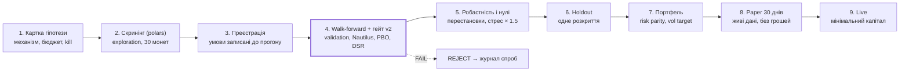

# Модуль 7. Валідація і гейт

> Курс «Теорія трейдингу для nautilus-lab — 2026», частина 7 з 13. Стан на 2026-10-07.

Головна загроза в алготрейдингу — не погана ідея, а **перенавчання на історії**. Якщо спробувати досить конфігурацій, одна з них обов'язково виглядатиме чудово чисто за випадком. Увесь апарат нижче відповідає на одне питання: чи переживе перевага дані, яких вона не бачила?

## In-sample, out-of-sample і walk-forward

- **In-sample (IS)** — дані, на яких обирають параметри. **Out-of-sample (OOS)** — дані, на яких лише звітують. Правило: IS лише обирає, OOS лише звітує.
- **Walk-forward** — вікно рухається вперед у часі: навчився на [t₀, t₁], торгуєш [t₁, t₂], зсуваєшся. Один фолд — одна така пара. Гейт вимагає ≥ 6 фолдів і ≥ 83% прибуткових після комісій.
- **Purging і embargo.** Якщо мітка навчального прикладу дивиться на 24 бари вперед, то приклади біля межі IS/OOS ділять майбутнє з тестом. Purging викидає їх, embargo додає зазор після тесту. У лабораторії embargo задається в одиницях часу мітки, а не в кількості рядків. Це правильно.
- **CPCV** (combinatorial purged CV) — замість одного шляху walk-forward створює багато комбінацій тестових блоків і дає розподіл Sharpe замість одного числа.

## Проблема багатьох спроб

У твоєму журналі вже десятки спроб на одному датасеті. Найкраща з N випадкових стратегій має очікуваний Sharpe не 0, а близько √(2 ln N) стандартних помилок. При N = 100 це ≈ 3 сигми ні з чого. Тому кожна спроба має бути записана, навіть невдала.

**Deflated Sharpe Ratio (DSR)** (Bailey, López de Prado, 2014) — це ймовірність, що справжній Sharpe вищий за SR₀, очікуваний максимум серед N випадкових спроб. Враховує довжину вибірки T, асиметрію γ₃ і товсті хвости γ₄:

```math
\mathrm{DSR} = \Phi\!\left( \frac{(\widehat{SR} - SR_0)\sqrt{T-1}}{\sqrt{1 - \gamma_3 \widehat{SR} + \frac{\gamma_4 - 1}{4}\widehat{SR}^2}} \right), \quad SR_0 = \sqrt{V[\widehat{SR}_n]}\left((1-\gamma)\Phi^{-1}\!\left(1-\tfrac{1}{N}\right) + \gamma\,\Phi^{-1}\!\left(1-\tfrac{1}{N e}\right)\right)
```

Гейт вимагає DSR ≥ 0.95. На 8 незалежних блоках це практично недосяжно. Це не дефект гейта, а чесна відповідь «даних замало». Ліки — більше монет і довша історія.

**PBO (Probability of Backtest Overfitting, CSCV)** — ділить історію на S блоків і перебирає всі способи вибрати половину як IS. Для кожної дивиться, куди потрапляє IS-переможець у рейтингу OOS. PBO — частка випадків, де він нижче медіани. 0.5 — це монетка, гейт допускає ≤ 0.3 (ADR 0006). `ema` ETH мав 0.486.

## Попередня реєстрація і журнал спроб

Запозичено з клінічних досліджень: **до** прогону записуєш гіпотезу, дані, параметри і критерії успіху. Після прогону їх не можна міняти. Кожен новий перемикач (`REGIME_LEGS`, фільтр входу) створює новий `trial_id` і рахується в N для DSR. Гіпотези H1 і H2 знайдено на тих самих OOS-даних. Тому доказом є лише тір C на монетах, яких розбір не бачив. Це зріла практика, рідкісна навіть у фондах.

## Бенчмарки

Результат без бенчмарку нічого не вартий. **Buy&hold** відповідає на питання «чи не простіше просто тримати?». **Vol-matched buy&hold** (ADR 0007) — утримання з такою ж волатильністю, як у стратегії. Робот, що 80% часу в кеші, не може обігнати сирий buy&hold у бичачому фолді, але може обігнати його за Sharpe. **Перестановки (null model)** — та сама стратегія на перемішаних даних. Якщо вона там так само «заробляє», сигналу немає.

## Гейт v2: дві фази

1. **Рівень альфи:** gross > 0 і breakeven ≥ 5 bps. Відповідає на питання «чи є сигнал взагалі».
2. **Нетто-результат за класом:** тренд — проти vol-matched B\&H; mean reversion — win rate ≥ 55% і ліміт обороту; carry — Sharpe, DSR і просадка.

Пороги зафіксовані в коді до прогонів (ADR 0003). Зміна порога після того, як побачив результат, — це p-hacking. Тому це вимагає нового ADR.

## Конвеєр від ідеї до live



Будь-який FAIL на будь-якому етапі = REJECT і запис у журнал спроб; повернення лише з новою карткою гіпотези.

Етапи 1–3 дешеві й відсіють більшість ідей. Етап 4 — єдиний, де числа рахуються для рішення. Holdout розкривається один раз за всю програму, не на кожну гіпотезу.

---

[← Модуль 6. Бектест і як він бреше](06-bektest-i-yak-vin-breshe.md) · [Зміст](README.md) · [Модуль 8. Ризик і розмір позиції →](08-ryzyk-i-rozmir-pozytsii.md)
