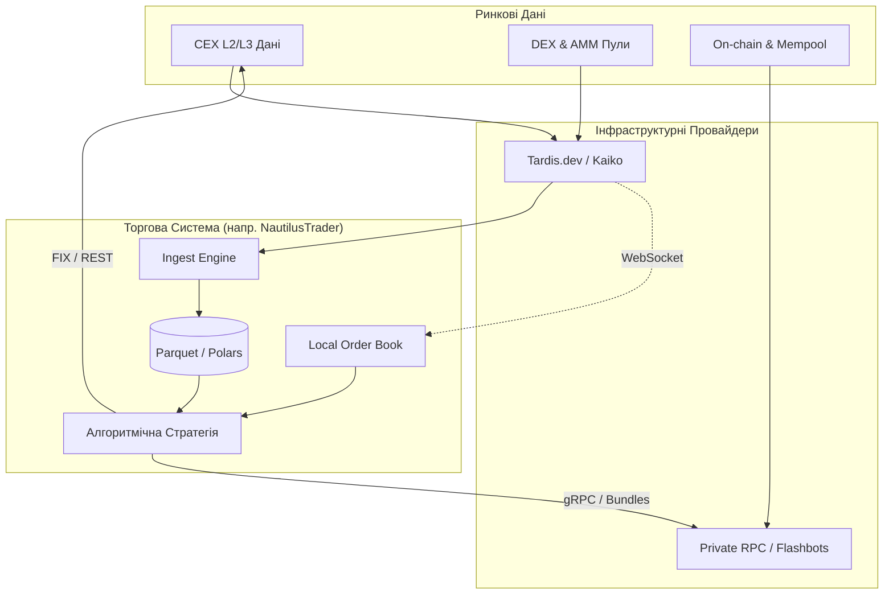
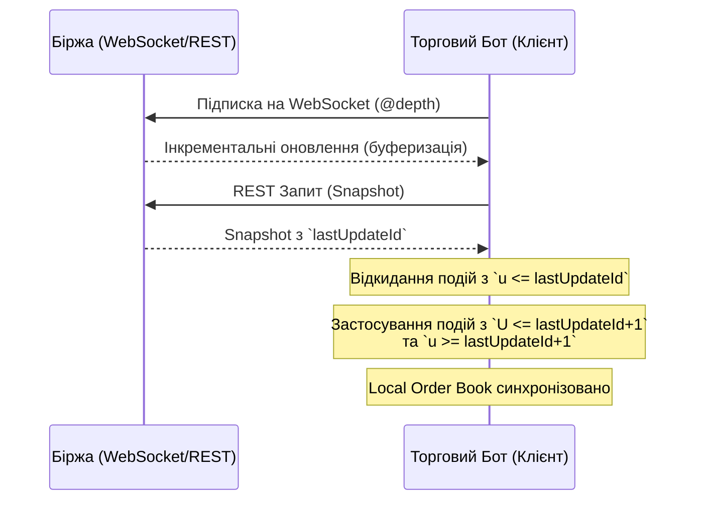
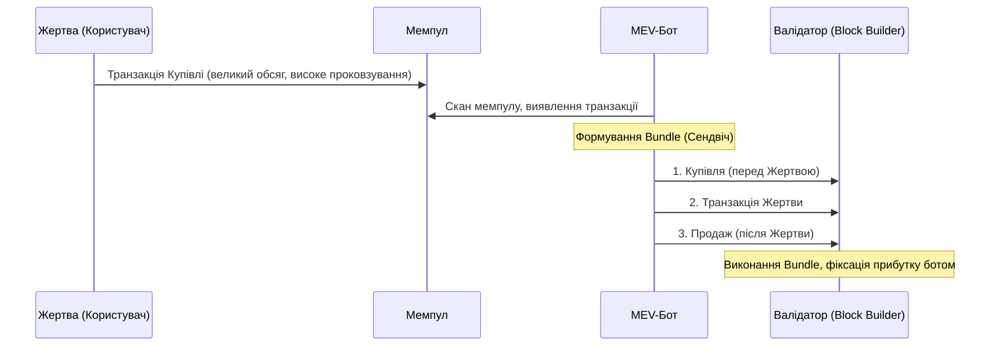

# **Інфраструктура та дані для алгоритмічної торгівлі криптоактивами: архітектура, джерела та мікроструктура**

## **Зміст**
1. [Фундаментальна типологія ринкових наборів даних](#фундаментальна-типологія-ринкових-наборів-даних)
2. [Джерела даних: Порівняльний аналіз провідних провайдерів інфраструктури](#джерела-даних-порівняльний-аналіз-провідних-провайдерів-інфраструктури)
3. [Протоколи передачі даних та архітектурне управління лімітами](#протоколи-передачі-даних-та-архітектурне-управління-лімітами)
4. [Мікроструктура книги ордерів: Реконструкція, синхронізація та затримки](#мікроструктура-книги-ордерів-реконструкція-синхронізація-та-затримки)
5. [Теоретичне підґрунтя мікроструктури: Несприятливий відбір, OFI та фізичні моделі LOB](#теоретичне-підґрунтя-мікроструктури-несприятливий-відбір-ofi-та-фізичні-моделі-lob)
6. [Затримки (Latency), колокація та децентралізований HFT](#затримки-latency-колокація-та-децентралізований-hft)
7. [Фрагментація ліквідності та інтелектуальна маршрутизація ордерів (SOR)](#фрагментація-ліквідності-та-інтелектуальна-маршрутизація-ордерів-sor)
8. [Ризики максимальної видобутої вартості (MEV) та захист транзакцій](#ризики-максимальної-видобутої-вартості-mev-та-захист-транзакцій)
9. [Зберігання даних та ретроспективне тестування (Backtesting)](#зберігання-даних-та-ретроспективне-тестування-backtesting)

Еволюція алгоритмічної торгівлі на криптовалютних ринках вимагає від кількісних фондів, маркетмейкерів та розробників автономних торгових систем переходу від простих цінових стратегій до складних імовірнісних моделей, що базуються на мікроструктурі ринку. Успішна автоматизована торгівля більше не залежить виключно від швидкості виставлення ордерів; вона критично залежить від якості, рівня деталізації та повноти даних, а також від архітектурної здатності системи обробляти ці інформаційні потоки без втрат, розсинхронізації чи затримок. Криптовалютний ринок характеризується екстремальною фрагментацією ліквідності, безперервною роботою (24/7), відсутністю єдиного національного центру котирувань та наявністю унікальних технологічних ризиків, таких як максимальна видобута вартість (MEV) на децентралізованих біржах[^1]. Відповідно, вибір релевантних наборів даних, розуміння мережевих протоколів їх доставки та інтеграція надійних інфраструктурних постачальників є фундаментальними факторами для забезпечення стабільної прибутковості алгоритмічних стратегій.

## **Фундаментальна типологія ринкових наборів даних**

Для побудови надійної алгоритмічної системи потрібен багатовимірний підхід до збору інформації. Стратегії високої частоти (HFT), статистичного арбітражу, міжбіржового маркетмейкінгу або алгоритмічного виконання (execution algorithms) вимагають різних типів даних, які класифікуються за рівнем деталізації, джерелом походження та затримкою генерації.

Найбільш критичним компонентом є дані централізованих бірж (CEX), які стратифікуються на декілька рівнів глибини. Дані першого рівня (Level 1\) відображають виключно найкращу ціну попиту та пропозиції (Best Bid/Ask) разом із розміром цих граничних заявок. Цей рівень зазвичай використовується для простих алгоритмів оцінки вартості портфеля або базових перевірок життєздатності ринку, але він є недостатнім для серйозного моделювання ліквідності[^4]. Дані другого рівня (Level 2\) надають агреговану глибину книги ордерів на різних цінових кроках. Це є галузевим стандартом для більшості кількісних стратегій, оскільки дозволяє системі оцінити наявну ліквідність та розрахувати очікуване проковзування (slippage) перед відправкою ордера значного обсягу[^4]. Дані третього рівня (Level 3\) є максимально деталізованими, оскільки вони транслюють інформацію про кожен окремий ордер у системі, включаючи його унікальний ідентифікатор, точний час розміщення та позицію в черзі виконання[^4]. Використання L3-даних є критично важливим для високочастотних маркетмейкерів, які моделюють мікроструктурну динаміку та ймовірність виконання власних лімітних заявок, зважуючи ризики несприятливого відбору (adverse selection)[^5].

Окрім спотових ринків, архітектура сучасних стратегій вимагає глибокої інтеграції з ринками деривативів, зокрема безстрокових ф'ючерсів (perpetual swaps) та опціонів. На ринку деривативів ключовим параметром виступає ставка фінансування (funding rate), яка забезпечує прив'язку ціни безстрокового контракту до базового спотового активу[^7]. Алгоритмічні стратегії "cash and carry" арбітражу постійно моніторять ці ставки на різних біржах. Коли ставка фінансування є позитивною (що є типовим для "бичачих" ринків), власники довгих позицій сплачують премію власникам коротких. Алгоритми використовують ці дані для відкриття ризик-нейтральних позицій: купують актив на спотовому ринку та одночасно відкривають коротку позицію аналогічного обсягу на ф'ючерсному, фіксуючи стабільний дохід, який може сягати близько 55% річних до моменту ущільнення спредів[^7]. Аналіз відкритого інтересу (open interest) та масивів ліквідацій також слугує потужним предиктором короткострокових сплесків волатильності, викликаних каскадними маржин-коллами[^10]. Для алгоритмів, що торгують опціонами, життєво необхідним є розрахунок поверхні імпліцитної волатильності (implied volatility surface). Провідні спеціалізовані біржі, такі як Deribit, надають API, що дозволяє отримувати поточні показники імпліцитної волатильності та автоматично оновлювати лімітні заявки (через спеціальні IV-ордери), зберігаючи ціну ордера прив'язаною до заданого рівня волатильності незалежно від коливань базового активу[^12].

Наступним інформаційним шаром є мережеві (ончейн) дані та метрики децентралізованих фінансів (DeFi). У криптовалютній екосистемі значний обсяг транзакцій, переміщення капіталу майнерів та блокування коштів у смарт-контрактах відбувається відкрито в блокчейні. Системний збір даних про притоки та відтоки стейблкоїнів на баланси бірж, рух активів великих гравців ("китів") або метрики реалізованої вартості (cost basis) слугує фундаментальним індикатором для алгоритмічних стратегій середньої частоти[^16]. Відстеження стану пулів ліквідності автоматизованих маркетмейкерів (AMM) дозволяє алгоритмам знаходити невідповідності між цінами на CEX та DEX, миттєво ініціюючи міжбіржовий арбітраж або експлуатуючи затримки оновлення оракулів[^18]. Додатковим рівнем є доступ до даних мемпулу (mempool), де алгоритми аналізують ще не підтверджені транзакції в мілісекундному режимі для виявлення можливостей фронтраннінгу, забезпечення ліквідності "точно в строк" (JIT liquidity) або реалізації складних сендвіч-атак[^19].

| Категорія ринкових даних | Рівень гранулярності | Ключове застосування в алгоритмічній торгівлі |
| :---- | :---- | :---- |
| **Спотовий ринок (L2/L3)** | Тікові оновлення (1-100 мс) | Маркетмейкінг, оцінка мікроструктури, розрахунок впливу ордера на ринок (market impact) |
| **Деривативи (Funding rates, OI)** | Хвилинні / Годинні агрегації | Cash and Carry арбітраж, виявлення каскадних ліквідацій, оцінка левериджу системи |
| **Опціони (IV Surface, Greeks)** | Тікові або хвилинні оновлення | Торгівля волатильністю, дельта-нейтральне хеджування, динамічне перебалансування |
| **Мережеві (On-chain) потоки** | Блоковий час (12 сек \- 10 хв) | Оцінка фундаментального попиту, відстеження великих гаманців, метрики прибутковості майнерів |
| **Мемпул (Mempool)** | Мілісекунди (непідтверджені tx) | Максимальна видобута вартість (MEV), сендвіч-атаки, JIT ліквідність |

## **Джерела даних: Порівняльний аналіз провідних провайдерів інфраструктури**

Спроба самостійно підтримувати підключення до десятків криптовалютних бірж для збору історичних та поточних даних є екстремально ресурсомістким завданням. Кожна біржа має власну архітектуру API, специфічні формати повідомлень, унікальні механізми управління розривами з'єднань та жорсткі ліміти запитів[^18]. Тому алгоритмічні фонди покладаються на спеціалізованих провайдерів, ринок яких чітко сегментований за цільовим призначенням: інституційні агрегатори CEX, постачальники тікової історії та платформи ончейн-аналітики.

Для отримання інституційних потоків нормалізованих даних з CEX беззаперечними лідерами є Kaiko та Amberdata. Kaiko пропонує високоточні L[^1] та L[^2] дані, агреговані довідкові ціни (reference rates), дані про деривативи та індекси, орієнтуючись на фонди, зберігачів активів (custodians) та регуляторів[^18]. Експертиза Kaiko полягає в наданні даних аудиторської якості: компанія сертифікована за стандартом SOC-2 Type II та повністю відповідає нормам Європейського Союзу BMR (Benchmark Regulation), що є критичним для ліцензованих алгоритмічних хедж-фондів, яким необхідно проводити оцінку справедливої вартості (fair value pricing) активів з дотриманням нормативних вимог[^23]. У червні 2026 року компанія Kaiko офіційно завершила поглинання Amberdata[^24]. Ця стратегічна консолідація створила єдину платформу, яка поєднує нормалізовані біржові потоки Kaiko з надзвичайно потужними можливостями Amberdata у сфері блокчейн-даних, DeFi-аналітики, моніторингу гаманців та пост-трейдових інструментів для бек-офісу[^24].

Коли справа доходить до ретроспективного тестування (backtesting) високочастотних стратегій, агреговані свічкові графіки не підходять; необхідна глибока історія мікроструктурних змін. Сервіс Tardis.dev є визнаним стандартом для HFT-дослідників, оскільки він зберігає "сирі" (raw) тікові дані, ордер-бук снепшоти, оновлення глибини та стрічки угод у нативному форматі бірж з мілісекундною точністю[^10]. Інфраструктура Tardis щоденно поглинає понад 15 терабайтів нових ринкових даних, обробляючи понад 400 000 WebSocket-повідомлень на секунду, а загальний архів налічує понад 5000 терабайтів високочастотних даних, що охоплюють понад 7 років історії для 200 000+ інструментів[^10]. Такий підхід дозволяє розробникам створювати локальні "машини часу" для точного відтворення стану книги ордерів. Альтернативою виступає CoinAPI, який, хоча й має широке охоплення (інтеграції з сотнями бірж), відрізняється філософією: він нормалізує всі дані у єдиний формат, що постачається через плоскі файли (Flat Files), REST, WebSocket або FIX[^4]. Це значно спрощує інтеграцію для команд, які не хочуть витрачати ресурси на парсинг нативних повідомлень кожної окремої біржі[^27]. Ще одним вузькоспеціалізованим гравцем є CryptoHFTData, який надає безкоштовні погодинні нормалізовані файли формату Parquet для вибіркового переліку бірж з 2025 року, що є оптимальним рішенням для дослідників, яким не потрібна історія до 2025 року, але потрібен високопродуктивний формат для Python-аналітики[^26].

У сегменті фундаментальної та мережевої (ончейн) аналітики беззаперечними лідерами є Glassnode та CryptoQuant. Ці платформи фокусуються на аналізі макроструктури ринку та потоків капіталу. Glassnode спеціалізується на глибокій побудові метрик біткоїна та ефіріуму, відстежуючи вартість придбання активів різними когортами інвесторів (наприклад, через метрики NUPL, SOPR) та динаміку ліквідної пропозиції на 11+ підтримуваних блокчейнах[^17]. З точки зору API, Glassnode є преміальним сервісом: безкоштовний доступ обмежується лише вебінтерфейсом (Studio) з денною роздільною здатністю та затримкою; план Advanced (близько 49 доларів США на місяць) надає обмежений доступ через Light API (лише 50 викликів на день), і лише план Professional (вартість якого historically становить близько 999 доларів США) відкриває повний доступ до історичних даних та 10-хвилинної роздільної здатності з використанням системи "Кредитів Даних" (1 кредит за запит щодо BTC, 2 кредити за альткоїни)[^30]. Альтернативою є використання їхнього протоколу x402, який дозволяє здійснювати поштучну оплату за кожен виклик API безпосередньо в USDC (наприклад, $0.05 за метрику)[^35].

CryptoQuant, з іншого боку, має свою спеціалізацію: їхньою найсильнішою стороною є аналіз потоків між біржами (Exchange Reserves, Netflows) та активності майнерів (Miner Netflows)[^17]. Їхня бібліотека метрик дозволяє алгоритмам розуміти, на якій саме біржі накопичується тиск продавців, і як швидко баланси китів переміщуються на централізовані майданчики. Цінова політика CryptoQuant також є більш гнучкою: підписка Advanced (близько 39 доларів США на місяць) дає 300 000 API-кредитів та погодинну або блокову роздільну здатність, тоді як план Professional (близько 109 доларів США на місяць) розширює цей ліміт до 500 000 кредитів[^16].

| Постачальник | Охоплення екосистеми | Головна архітектурна або аналітична перевага | Формат доставки / Інтеграції |
| :---- | :---- | :---- | :---- |
| **Kaiko / Amberdata** | CEX \+ DEX \+ DeFi \+ Options | Інституційний аудит, SOC-2, BMR, консолідація даних CeFi та DeFi | REST, WS, Cloud Delivery |
| **Tardis.dev** | High-frequency CEX & Derivatives | Нативні незмінені біржові повідомлення, 7+ років тікової історії, 15 ТБ/день | CSV, API Replay, Python/Node.js |
| **CoinAPI** | Агрегатор (сотні бірж) | Сувора нормалізація в єдиний стандарт, зручність розробки | REST, WS, FIX, Flat Files |
| **Glassnode** | 11+ Блокчейнів (On-chain) | Глибокий аналіз когорт, мікроструктура ончейн-пропозиції | REST API, x402 (pay-per-use) |
| **CryptoQuant** | Блокчейни \+ CEX | Біржові резерви, міжбіржові потоки капіталу (Exchange Netflows) | REST API, Telegram Alerts |
| **CryptoHFTData** | Фокус на топ-9 біржах | Заздалегідь підготовлені нормалізовані погодинні Zstd/Parquet файли | Bulk Download, AWS S[^3] |

## **Протоколи передачі даних та архітектурне управління лімітами**

Для отримання даних та надсилання торгових наказів розробники алгоритмів стикаються з вибором між різними мережевими протоколами: REST, WebSocket та FIX. Кожен з них має суворо визначене призначення, а їх неправильне використання призводить до виснаження лімітів запитів (rate limits) та катастрофічних затримок[^36].

Протокол REST (Representational State Transfer) є індустріальним стандартом для синхронних операцій "за вимогою", таких як перевірка поточного балансу рахунку, отримання списку доступних інструментів, управління налаштуваннями кредитного плеча або одноразове завантаження історичних агрегованих даних[^36]. Однак REST використовує модель опитування (polling), яка є вкрай неефективною для потокових даних та високочастотного трейдингу. Кожен HTTP-запит включає значні накладні витрати: розв'язання DNS, встановлення TCP та TLS-з'єднання, а також передачу об'ємних HTTP-заголовків, що додає десятки мілісекунд штучної затримки до кожного циклу[^38]. Щобільше, криптовалютні біржі застосовують надзвичайно жорсткі ліміти на REST-запити для захисту своїх двигунів зведення ордерів (matching engines).

Розглянемо архітектуру лімітів на прикладі Binance, як найбільш репрезентативного майданчика. Binance запровадила складну систему "ваги запиту" (request weight), де прості запити коштують 1 одиницю ваги, тоді як важкі агреговані запити (наприклад, отримання глибокої книги ордерів) можуть коштувати 50 одиниць[^39]. Загальний ліміт для стандартного акаунта становить 6000 одиниць ваги на хвилину на одну IP-адресу[^39]. Якщо торговий бот перевищить цей поріг під час ринкової волатильності, біржа поверне помилку HTTP 429 ("Too Many Requests") з заголовком Retry-After, що вимагає зупинки опитування[^39]. Продовження агресивних запитів після отримання статусу 429 призводить до автоматичного бану IP-адреси на мережевому рівні, що сигналізується кодом HTTP 418, причому тривалість бану експоненційно зростає від 2 хвилин до 3 діб для систематичних порушників[^39]. Професійні алгоритми уникають цих помилок, відстежуючи спеціальні заголовки відповіді (наприклад, X-MBX-USED-WEIGHT-1M) та імплементуючи логіку експоненційного відступу (exponential backoff) або тимчасового переходу в режим очікування, коли використана вага наближається до 90% від дозволеного порогу (5400 одиниць)[^37].

Щоб уникнути обмежень REST, системи переміщують всю роботу з маркет-датою на WebSocket (WS). Цей протокол встановлює постійне повнодуплексне з'єднання через TCP, що дозволяє біржі безперервно відправляти оновлення в режимі реального часу (push-модель) без повторних рукостискань[^36]. Перехід на WebSocket знижує навантаження на систему та зменшує затримку ринкових даних до одиниць мілісекунд[^38]. Обмеження для WebSocket мають іншу природу: на Binance одна IP-адреса може встановлювати не більше 300 з'єднань кожні 5 хвилин, а кожне з'єднання може підтримувати підписку на максимум 1024 незалежні потоки (streams)[^39]. Ліміт вхідних повідомлень (від клієнта до сервера) становить лише 5 кадрів на секунду; перевищення цього ліміту призводить до негайного примусового розриву з'єднання[^42]. Також клієнт повинен підтримувати активність з'єднання за допомогою протоколу Ping/Pong: сервер Binance відправляє Ping-кадр кожні 3 хвилини, і якщо клієнт не відповідає коректним Pong-кадром протягом 10 хвилин, сокет автоматично закривається[^42]. У прагненні до подальшого зниження мікросекундних затримок, провідні платформи (включно з Binance) почали впроваджувати трансляцію через Simple Binary Encoding (SBE) замість текстового формату JSON. SBE формує надзвичайно компактні бінарні пакети, які оминають ресурсомісткий процес десеріалізації рядків, дозволяючи рушіям алгоритмів обробляти дані миттєво[^47].

Для критичного шляху виконання ордерів інституційні учасники та проп-трейдингові фірми завжди віддають перевагу протоколу FIX (Financial Information eXchange). FIX, що десятиліттями використовується на традиційних фондових ринках, пропонує строге впорядкування повідомлень на основі порядкових номерів (Sequence Numbers) та вбудовані механізми відновлення пропущених пакетів у межах торговельної сесії[^36]. З точки зору пропускної здатності, на тій же біржі Binance FIX-сесія для введення ордерів дозволяє надсилати 10 000 повідомлень кожні 10 секунд, що на два порядки перевищує ліміти REST-інфраструктури[^36]. Найбільшою перевагою FIX є функціонал скасування ордерів при відключенні (Cancel-on-Disconnect \- COD). Якщо алгоритм втрачає зв'язок з біржею (через падіння мережі або сервера), торговий рушій біржі автоматично скасовує всі відкриті лімітні заявки цього клієнта після закінчення заданого тайм-ауту, запобігаючи неконтрольованому накопиченню токсичного інвентарю під час "сліпої зони"48.

Оптимальна інфраструктурна архітектура, відповідно, не передбачає вибору лише одного протоколу, а використовує їх у синергії: WebSocket — для безперервного прослуховування мікроструктури ринку та оновлень книги ордерів; REST — для ініціалізації середовища, звірки стану після розривів зв'язку та резервних дій; FIX (або високошвидкісні WebSocket API на DEX) — виключно для детермінованого та низьколатентного маршрутизації торгових наказів[^36].

## **Мікроструктура книги ордерів: Реконструкція, синхронізація та затримки**

Підтримка консистентної локальної копії книги ордерів (Local Order Book) у реальному часі є фундаментальною вимогою для оцінки ліквідності та проковзування, проте це є серйозним інженерним викликом. Біржі ніколи не транслюють повну книгу ордерів (яка може містити тисячі цінових рівнів) при кожній зміні ціни. Натомість вони використовують інкрементальні оновлення — так звані потоки "Diff Depth", що економить смугу пропускання, але перекладає тягар реконструкції стану на клієнта[^51].

Математично точний процес підтримки цієї структури (задокументований, зокрема, Binance) вимагає суворого управління станом. По-перше, алгоритм відкриває з'єднання WebSocket і підписується на потік інкрементальних оновлень (наприклад, @depth). Замість негайного застосування цих даних, система повинна зберігати всі вхідні повідомлення у локальний буфер[^52]. По-друге, поки йде буферизація, паралельно відправляється REST-запит на отримання повного знімка (snapshot) поточної книги ордерів, який містить ідентифікатор останнього включеного оновлення (lastUpdateId)[^53]. По-третє, після отримання знімка, алгоритм аналізує свій буфер. Для кожного повідомлення в буфері, яке має ідентифікатор початкової події (U) та ідентифікатор фінальної події (u), система беззастережно відкидає всі події, де u менший або дорівнює lastUpdateId з REST-знімка, оскільки вони містять застарілу інформацію, вже відображену в знімку[^52]. Четвертий крок: локальна структура даних ініціалізується даними зі знімка, і до неї починають послідовно застосовуватися збережені в буфері (а згодом і нові) події, починаючи з тієї, де U \<= lastUpdateId \+ 1 і u \>= lastUpdateId \+ 152.

Кожне нове оновлення переписує обсяг на специфічному ціновому рівні. Якщо переданий обсяг дорівнює нулю, цей ціновий рівень повністю видаляється зі структури[^51]. Найбільша небезпека в цьому процесі — втрата пакетів через мережевий джиттер. Якщо система отримує повідомлення, в якому U (початковий ID) не дорівнює u \+ 1 (фінальному ID) попереднього повідомлення, це є математичним доказом втрати даних[^51]. У цей момент локальна книга стає недостовірною (stale). Спроба "аппроксимувати" пропущені зміни призведе до фатальних торгових рішень. Алгоритм повинен негайно скинути локальний стан, зупинити торгівлю, очистити буфери і розпочати процес синхронізації (REST-знімок \+ буферизація) з самого початку[^51]. Розуміючи цю вразливість, платформи на зразок WhiteBIT впровадили механізм "keepalive": якщо протягом 10 секунд на ринку не відбувається жодних змін, сервер примусово надсилає повний знімок книги ордерів без ідентифікатора минулого оновлення, що дозволяє клієнтам регулярно валідувати консистентність своєї моделі без виконання дорогих REST-запитів[^54].

## **Теоретичне підґрунтя мікроструктури: Несприятливий відбір, OFI та фізичні моделі LOB**

Аналіз мікроструктури ринку є об'єктом пильної уваги академічної спільноти, яка досліджує механізми ціноутворення на горизонті мілісекунд. Згідно з дослідженнями, опублікованими на ресурсах на зразок arXiv, цінова динаміка криптовалют майже повністю визначається не фундаментальними новинами чи макроекономікою, а мікроструктурним дисбалансом попиту та пропозиції безпосередньо в Limit Order Book (LOB)[^1].

Дослідники виявили, що сконструйовані метрики, такі як дисбаланс потоку ордерів (Order Flow Imbalance \- OFI) та відхилення ціни, зваженої за обсягом (VWAP), від середньої ціни (mid-price), демонструють універсальну прогностичну здатність (SHAP dependence shapes) для криптовалют різних рівнів капіталізації[^56]. Цікаво, що багато авторів критикують надмірне захоплення складними глибокими нейронними мережами (CNN, LSTM) для прогнозування наступного руху ціни (mid-price change). Прагматичні дослідження показують, що лінійні моделі (логістична регресія) або методи градієнтного бустингу (наприклад, CatBoost), натреновані на якісних мікроструктурних ознаках, досягають точності у 48-64%1. Головна перевага простіших моделей полягає в швидкості логічного висновку (inference latency): у високочастотній торгівлі можливість передбачити зміну ціни за кілька мікросекунд і скасувати застарілий ордер є значно важливішою, ніж мінімальний приріст точності нейромережі, яка витрачає мілісекунди на обчислення[^1]. Крім того, передові підходи розглядають книгу ордерів через призму статистичної фізики, де лімітні ордери діють як частинки в системі; розрахунок "кінетичної енергії" та "імпульсу" цих скупчень ордерів на різних рівнях активної глибини дозволяє створювати моделі оцінки волатильності, які перевершують традиційні економетричні бенчмарки (наприклад, VPIN)[^5].

З іншого боку, мікроструктура приховує екзистенційні ризики для стратегій надання ліквідності (маркетмейкінгу). Коли алгоритм виставляє котирування (maker orders), він зазнає ризику несприятливого відбору (adverse selection) або "прокляття переможця"6. Це відбувається, коли на ринок надходить нова інформація, але маркетмейкер не встигає оновити свої лімітні ордери через мережеву затримку. Швидкі арбітражери (latency arbitrageurs) або поінформовані трейдери негайно викупають ці застарілі ("stale") котирування, залишаючи маркетмейкера з токсичним інвентарем, який миттєво знецінюється в міру того, як ринок рухається проти нього[^58]. Щоб компенсувати ці збитки, алгоритми маркетмейкінгу автоматично розширюють спреди та зменшують обсяги заявок під час сплесків волатильності[^59]. Сучасні стохастичні моделі оптимального маркетмейкінгу також враховують феномен витоку інформації або "зчитування ціни" (price reading / skew sniffing)[^6]. Це ситуація, коли хижі алгоритми аналізують асиметрію (quote skewness) лімітних заявок маркетмейкера на різних рівнях глибини, щоб математично вивести напрямок накопиченого ним інвентарю. Якщо хижий бот бачить, що маркетмейкер агресивно намагається позбутися лонгової позиції, він адаптує свою стратегію для експлуатації цієї тимчасової вразливості, формуючи зворотний зв'язок, що тисне на ринкову ціну[^6].

Також варто звернути увагу на вплив сентименту ринку. Аналіз показує, що ринкова невизначеність щодо сентименту має переважно алеаторну природу (81,6% \- притаманний ринку стохастичний шум), а не епістемічну (18,4% \- нестача інформації в моделі)[^61]. Це означає, що ринковий сентимент у криптовалютах структурно відрізняється від традиційних фінансів: він генерує постійний мікроструктурний шум від роздрібних трейдерів, на який алгоритмам краще реагувати через прості макро-режими (визначення фаз екстремального страху чи жадібності), ніж намагатися фільтрувати кожне окреме інформаційне повідомлення[^61].

## **Затримки (Latency), колокація та децентралізований HFT**

Фізична затримка передачі даних є межею, яку неможливо подолати виключно програмною оптимізацією. На традиційних ринках (наприклад, CME або NASDAQ) HFT-фірми орендують місце для своїх серверів безпосередньо в тих самих будівлях, де знаходяться сервери біржі (колокація), використовуючи спеціалізовані плати FPGA, що зменшує затримку до одиниць мікросекунд (0,01-0,5 мс)[^62]. У криптовалютній екосистемі "високочастотна" торгівля зазвичай оперує в масштабах 20-500 мілісекунд (в 1000 разів повільніше), оскільки 50-80% часу кругового маршруту витрачається на маршрутизацію через публічний інтернет[^62]. Відповідно, правильне географічне розміщення серверів є критичним. Більшість алгоритмічних команд розміщують свої обчислювальні потужності у відповідних регіонах хмарних провайдерів: наприклад, сервери Binance історично розміщуються в зоні AWS ap-northeast-1 (Токіо), тоді як Coinbase та Kraken працюють в AWS us-east-1 (Північна Вірджинія) або Європі[^62]. Це просте географічне узгодження дозволяє скоротити базову мережеву затримку до 5-10 мілісекунд, що експоненційно підвищує відсоток успішних перехоплень арбітражних можливостей[^62].

Значні зміни у парадигмі виконання відбуваються у секторі децентралізованих фінансів, зокрема завдяки L1-блокчейнам, оптимізованим спеціально для ордерної торгівлі, таким як Hyperliquid. Ця платформа базується на кастомному консенсусі HyperBFT і обіцяє теоретичну фінальність транзакцій на рівні 0,2 секунди без використання традиційного мемпулу[^65]. Проте емпіричні вимірювання за допомогою зондів, розміщених в AWS Tokyo, показують, що реальна медіанна затримка повного циклу виконання (round-trip time) становить близько 884 мілісекунд, де мережевий пінг займає лише 5 мс, а решта 879 мс витрачається на серверне опрацювання та включення транзакції в блоки валідаторів[^65]. Для інституційного подолання обмежень публічних REST-ендпоінтів (які мають жорсткий ліміт у 100 запитів на хвилину67), архітектура передбачає розгортання власних невалідуючих вузлів або використання спеціалізованих приватних шлюзів (наприклад, HypeRPC або GoldRush)[^67]. Ці шлюзи використовують пряме gRPC-з'єднання з мережею і підвищують ліміт пропускної здатності до 12 000 одиниць ваги на хвилину, дозволяючи отримувати потоки подій (blocks, fills, book updates) з максимальним детермінізмом[^67]. Цікаво, що протокол виконання Hyperliquid розроблений для захисту маркетмейкерів: транзакції додавання ліквідності (ALO) та скасування ордерів виконуються в блоці консенсусу *перед* агресивними ринковими ордерами (IOC), що частково нівелює проблему токсичного потоку та латентного арбітражу, стимулюючи формування глибоких книг ордерів[^66].

| Параметр Latency / Інфраструктури | Традиційний HFT (Equities) | Крипто HFT (CEX) | Децентралізований L[^1] (Hyperliquid) |
| :---- | :---- | :---- | :---- |
| **Очікувана затримка виконання** | 10–500 мікросекунд | 20–500 мілісекунд | \~884 мілісекунди (через API) |
| **Фізичне розміщення (Колокація)** | Сервери в дата-центрі біржі | AWS/GCP кластери (Токіо, Вірджинія) | AWS Токіо \+ Невалідуючі вузли |
| **Апаратне забезпечення** | Кастомні FPGA, мікрохвилі | Стандартні Cloud VM, оптимізація TCP | Dedicated Nodes (32 Cores, 128GB RAM) |
| **Домінуюче вузьке місце** | Обчислення моделі (0.5-5 мс) | Маршрутизація Інтернет/API (50-80% часу) | Консенсус блокчейну / Обробка блоків |

## **Фрагментація ліквідності та інтелектуальна маршрутизація ордерів (SOR)**

Головною структурною проблемою криптовалютного ринку є екстремальна фрагментація ліквідності. На відміну від традиційних ринків, де існує єдина централізована стрічка (consolidated tape), один і той самий криптоактив може торгуватися на десятках централізованих бірж (CEX), децентралізованих протоколів (DEX) та позабіржових платформах (OTC/ECN)[^3]. Через це не існує єдиної "найкращої ціни". Виконання великого інституційного ордера на одній біржі неминуче призведе до споживання всіх доступних рівнів у місцевій книзі ордерів, що викличе величезне цінове проковзування (slippage)[^3]. Водночас DEX-платформи, що працюють за формулою константної функції (наприклад, ![][image1] у Uniswap), мають власну математику проковзування, яка також сильно карає великі ордери за відсутності концентрованої ліквідності[^3].

Для розв'язання цієї проблеми алгоритмічні торгові столи (desks) впроваджують системи інтелектуальної маршрутизації ордерів (Smart Order Routing \- SOR) від таких інфраструктурних провайдерів, як Talos та CoinRoutes. SOR — це алгоритмічний двигун, який безперервно консолідує книги ордерів з десятків підключених майданчиків, створюючи єдиний агрегований ринок (Consolidated Best Bid and Offer \- CBBO)[^71]. Оскільки кожна біржа має різні комісійні структури, SOR нормалізує ціни, обчислюючи реальну чисту вартість виконання (fee-aware routing)[^71]. Коли надходить великий ордер, двигун алгоритмічно розщеплює його на менші частини (child orders) та направляє їх одночасно на ті біржі, де наразі існує достатня глибина для абсорбування обсягу з найменшим впливом на ринок[^72].

Хоча компанії працюють в одній ніші, їхній фокус різниться. Платформа CoinRoutes зосереджена переважно на оптимізації самого алгоритму виконання. Вони надають доступ до просунутих квантових стратегій, таких як SmartPost (яка динамічно визначає, чи варто пасивно надавати ліквідність, чи перетнути спред, що дозволяє зекономити понад 20 базисних пунктів на безстрокових ф'ючерсах під час волатильності), а також інструментів TWAP (Time-Weighted Average Price) та VWAP (Volume-Weighted Average Price)[^72]. Ці алгоритми планомірно розподіляють виконання обсягу в часі, приховуючи наміри великого гравця від ринку[^3]. З іншого боку, Talos позиціює себе як комплексна операційна система для інституційного життєвого циклу. Їхня архітектура охоплює не лише софт для агрегації (ОEMS) та SOR, але й глибоку інтеграцію з кастодіанами, модулі для торгівлі опціонами, проведення RFQ (Request for Quote) серед прайм-брокерів та інструменти пост-трейдового врегулювання (settlement) та управління ризиками портфеля[^71]. Гібридні торгові моделі, де ліквідні мейджор-активи торгуються на CEX через FIX, а специфічні DeFi-позиції формуються на DEX, дозволяють фондам диверсифікувати ризики контрагентів і максимізувати ефективність капіталу[^69].

## **Ризики максимальної видобутої вартості (MEV) та захист транзакцій**

Управління ордерами в децентралізованих мережах (наприклад, Ethereum або Solana) створює фундаментально новий вектор ризику, відсутній у класичних фінансах, — Максимальну видобуту вартість (Maximal Extractable Value \- MEV). Проблема виникає через те, що транзакції до включення в блок зберігаються у відкритому мемпулі (mempool), де їх можуть бачити всі учасники мережі[^2]. Алгоритмічні боти-пошуковці (searchers) безперервно сканують мемпул у пошуках цінних угод.

Якщо торгова система відправляє транзакцію купівлі великого обсягу активу на DEX з допустимим рівнем проковзування, MEV-бот може ініціювати так звану "сендвіч-атаку". Бот автоматично формує пакет із двох транзакцій: перша транзакція купує актив *перед* транзакцією жертви (сплачуючи вищу комісію майнеру/валідатору за пріоритет), а друга транзакція продає актив *відразу після* угоди жертви[^19]. Внаслідок цього ордер торгової системи виконується за найгіршою можливою ціною (штучно завищеною першим ордером бота), а бот фіксує безризиковий прибуток з утвореного проковзування. Масштаб цієї діяльності колосальний: лише один оператор (jaredfromsubway.eth) згенерував десятки мільйонів доларів прибутку виключно за рахунок сендвіч-атак[^19].

Для захисту інституційних стратегій та виконання власного арбітражу, екосистема перейшла на використання приватних RPC-сервісів та аукціонів потоку ордерів (Order Flow Auctions), піонером яких став проєкт Flashbots[^2]. Замість публікації в загальний мемпул, алгоритм обгортає транзакції у "бандл" (bundle) і надсилає його через спеціалізований метод API (наприклад, eth\_sendBundle) безпосередньо конструкторам блоків (block builders)[^2]. Цей механізм гарантує передторговельну конфіденційність: транзакції залишаються невидимими до моменту виконання[^2]. Ба більше, бандл є атомарним — він виконується лише за умови, що всі транзакції в ньому є успішними. Якщо ринкові умови змінюються і арбітраж стає збитковим, бандл просто відхиляється без сплати комісій за газ (revert protection)[^2].

Еволюція цього механізму породила такі сервіси, як Flashbots Protect RPC та MEV Blocker. Вони не лише захищають транзакції користувача від сендвіч-атак, але й створюють ринок зворотного викупу цінності (backrun auctions). Якщо транзакція фонду сама по собі створює арбітражну можливість для інших, мережа пошуковців змагається за право "бекранити" цю транзакцію, а переможець аукціону автоматично повертає до 90% захопленого прибутку назад ініціатору оригінальної транзакції[^19]. Для алгоритмів, що спеціалізуються на надшвидкому ліквідаційному або CEX-DEX арбітражі, вирішальне значення має затримка доставки самих бандлів. На цьому рівні застосовуються спеціалізовані рішення на зразок BloXroute (BDN), що використовують власну релейну мережу для прискорення розповсюдження транзакцій серед валідаторів[^19]. В екосистемах з коротким часом слоту (наприклад, Solana), боти розміщують своє обладнання в одному локальному дата-центрі (LAN) з лідером слота, зводячи мережеву затримку передачі бандлу до значень \<1 мс, що є єдиним способом випередити конкурентів при виникненні цінової розбіжності між книгами ордерів CEX та пулами AMM[^85].

## **Зберігання даних та ретроспективне тестування (Backtesting)**

Кінцевим, але не менш важливим компонентом архітектури є інфраструктура для валідації гіпотез та ретроспективного тестування (backtesting). Бектестування є критичним процесом, який визначає, чи зможе стратегія генерувати прибуток у реальному ринковому середовищі, враховуючи всі приховані витрати[^86]. Головна різниця між аматорськими та інституційними системами полягає у виборі формату даних та глибині аналізу[^87].

> [!NOTE]
> **Практичне застосування в `nautilus-lab`**
> У контексті розробки стратегій на базі `NautilusTrader` (як у поточній лабораторії), цей процес реалізовано через команду `uv run lab ingest`, яка завантажує публічні тікові та свічкові дані з Binance і зберігає їх у Parquet-каталогах. Рушій на Rust забезпечує швидке відтворення (replay) цих подій, що дозволяє досягти інституційної точності бектесту, перевіряючи гіпотези за допомогою Walk-Forward аналізу та інструментів на кшталт `Polars` для постобробки.

Аматорські стратегії часто покладаються на агреговані свічкові дані (OHLCV), які повністю приховують внутрішню мікроструктурну динаміку, зміни спреду та шлях ціни всередині інтервалу[^87]. Інституційні платформи обов'язково використовують тікові дані (tick data або trade executions). Цей формат зберігає кожну транзакцію в книзі ордерів з точними мілісекундними часовими мітками, розміром ордера та напрямком угоди (maker/taker)[^88]. Тільки використання тікових даних у поєднанні зі знімками книг ордерів дозволяє симулятору розрахувати точний вплив комісій маркетмейкера/тейкера та коректно змоделювати обсяг цінового проковзування при виконанні великого лота[^87].

Оскільки криптовалютний ринок генерує петабайти інформації, зберігання та обробка цих масивів вимагає спеціалізованих інженерних рішень. Текстові формати на кшталт CSV або JSON створюють величезне навантаження на систему введення/виведення та пам'ять серверів[^88]. Індустріальним стандартом зберігання фінансових часових рядів є використання колоночного формату Apache Parquet, скомпресованого за допомогою алгоритмів Snappy або Zstandard (Zstd)[^86]. Parquet дозволяє стискати дані в 5-7 разів ефективніше за рахунок групування однотипних колонок (наприклад, ідентифікаторів інструменту або символів), а аналітичні запити (наприклад, у DuckDB або Polars) виконуються на порядки швидше, оскільки система завантажує в пам'ять лише релевантні для бектесту колонки (ціна, обсяг), ігноруючи решту метаданих[^86].

Валідація стратегії в бектесті не зводиться лише до обчислення накопиченого прибутку. Аналіз вимагає оцінки здатності стратегії генерувати стабільний дохід з урахуванням взятих на себе ризиків[^87]. Ключовими бенчмарками тут виступають:

* **Коефіцієнт Шарпа (Sharpe Ratio):** Вимірює ризик-скориговану прибутковість. Стратегія, що демонструє коефіцієнт понад 2.0, розглядається як стабільна система, придатна для розподілу капіталу[^87].  
* **Максимальне осідання (Maximum Drawdown):** Показує найбільший історичний провал кривої капіталу від піка до дна. Це метрика найгіршого сценарію, яка диктує жорсткість правил управління капіталом (position sizing) і допомагає уникнути психологічного зламу під час просадки[^87].  
* **Коефіцієнт Сортіно (Sortino Ratio):** Є вдосконаленою версією Шарпа, оскільки фокусується виключно на негативній волатильності, не штрафуючи алгоритм за раптові стрибки прибутковості[^87].

Усі ці показники в сукупності захищають алгоритмічний фонд від перенавчання моделі (overfitting) і гарантують, що теоретичні здобутки трансформуються в реальний фінансовий результат.

#### **Джерела**

[^1]: Exploring Microstructural Dynamics in Cryptocurrency Limit Order, [https://arxiv.org/html/2506.05764v2](https://arxiv.org/html/2506.05764v2)  
[^2]: Overview \- Flashbots Docs, [https://docs.flashbots.net/flashbots-auction/overview](https://docs.flashbots.net/flashbots-auction/overview)  
[^3]: What Is Slippage in Crypto? 2025 Guide to DEX & CEX Costs, [https://blog.sei.io/trading/dex/what-is-slippage-crypto-guide/](https://blog.sei.io/trading/dex/what-is-slippage-crypto-guide/)  
[^4]: How Deep Is Crypto Order Book Data? Historical Coverage and, [https://www.coinapi.io/blog/how-deep-is-crypto-order-book-data](https://www.coinapi.io/blog/how-deep-is-crypto-order-book-data)  
[^5]: An Empirical Analysis on Financial Markets \- arXiv, [https://arxiv.org/pdf/2308.14235](https://arxiv.org/pdf/2308.14235)  
[^6]: Optimal Quoting under Adverse Selection and Price Reading \- arXiv, [https://arxiv.org/html/2508.20225v2](https://arxiv.org/html/2508.20225v2)  
[^7]: Crypto Arbitrage (1 Week Setup) \- HangukQuant Research, [https://www.research.hangukquant.com/p/crypto-arbitrage-1-week-setup](https://www.research.hangukquant.com/p/crypto-arbitrage-1-week-setup)  
[^8]: The crypto arbitrage playbook: what still pays in 2026 (and ... \- CCXT, [https://docs.ccxt.com/blog/crypto-arbitrage-strategies](https://docs.ccxt.com/blog/crypto-arbitrage-strategies)  
[^9]: Funding rate arbitrage in crypto: how the strategy works \- Kraken, [https://www.kraken.com/learn/futures-trading-funding-rate-arbitrage](https://www.kraken.com/learn/futures-trading-funding-rate-arbitrage)  
[^10]: The most granular data for cryptocurrency markets — Tardis.dev, [https://tardis.dev/](https://tardis.dev/)  
[^11]: How to Use Funding Rate Arbitrage? \- CoinGlass, [https://www.coinglass.com/learn/fr-arbitrage-en](https://www.coinglass.com/learn/fr-arbitrage-en)  
[^12]: IV Order \- Options \- Deribit Support, [https://support.deribit.com/hc/en-us/articles/25944809696029-IV-Order-Options](https://support.deribit.com/hc/en-us/articles/25944809696029-IV-Order-Options)  
[^13]: Endpoints · Deribit API, [https://deribitexchange.gitbooks.io/deribit-api/rpc-endpoints.html](https://deribitexchange.gitbooks.io/deribit-api/rpc-endpoints.html)  
[^14]: public/get\_order\_book \- Deribit API, [https://docs.deribit.com/api-reference/market-data/public-get\_order\_book](https://docs.deribit.com/api-reference/market-data/public-get_order_book)  
[^15]: deribit\_websocket \- Rust \- Docs.rs, [https://docs.rs/deribit-websocket](https://docs.rs/deribit-websocket)  
[^16]: Pricing \- CryptoQuant, [https://cryptoquant.com/pricing](https://cryptoquant.com/pricing)  
[^17]: CryptoQuant Pricing, API Plans & Alternatives (2026) \- Cryptint, [https://cryptint.io/compare/cryptoquant](https://cryptint.io/compare/cryptoquant)  
[^18]: Best Crypto Market Data APIs in 2026 \- Bitquery, [https://bitquery.io/blog/best-crypto-market-data-api](https://bitquery.io/blog/best-crypto-market-data-api)  
[^19]: MEV Bot Guide 2026: Types, Flashbots and Protection \- Plisio.net, [https://plisio.net/crypto/mev-bot](https://plisio.net/crypto/mev-bot)  
[^20]: Automated Market Makers: Mean-Variance Analysis of LPs Payoffs, [https://arxiv.org/pdf/2212.00336](https://arxiv.org/pdf/2212.00336)  
[^21]: MEV Bot Infrastructure: RPC, Latency & Cost \- Dwellir, [https://www.dwellir.com/blog/mev-arbitrage-bot-infrastructure](https://www.dwellir.com/blog/mev-arbitrage-bot-infrastructure)  
[^22]: General \- Tardis.dev Documentation, [https://docs.tardis.dev/faq/general](https://docs.tardis.dev/faq/general)  
[^23]: Kaiko: The crypto industry's leading data, analytics, and indices, [https://www.kaiko.com/](https://www.kaiko.com/)  
[^24]: Amberdata: Best Crypto Market & Blockchain API, [https://www.amberdata.io/](https://www.amberdata.io/)  
[^25]: Kaiko Acquires Amberdata to Enhance Institutional Crypto ... \- Binance, [https://www.binance.com/ru-UA/square/post/06-02-2026-kaiko-acquires-amberdata-to-enhance-institutional-crypto-data-services-329816643632497](https://www.binance.com/ru-UA/square/post/06-02-2026-kaiko-acquires-amberdata-to-enhance-institutional-crypto-data-services-329816643632497)  
[^26]: Tardis.dev Alternative (2026) \- CryptoHFTData, [https://www.cryptohftdata.com/vs/tardis-dev](https://www.cryptohftdata.com/vs/tardis-dev)  
[^27]: Crypto Market Data Provider Comparisons \- CryptoHFTData, [https://www.cryptohftdata.com/vs](https://www.cryptohftdata.com/vs)  
[^28]: Top Crypto Market Data Platforms: Best Tools for Beginners and, [https://www.coinapi.io/blog/crypto-market-data-platforms-beginners-to-advanced](https://www.coinapi.io/blog/crypto-market-data-platforms-beginners-to-advanced)  
[^29]: Historical Crypto Market Data Providers Compared (2026), [https://www.cryptohftdata.com/blog/cryptohftdata-vs-competitors](https://www.cryptohftdata.com/blog/cryptohftdata-vs-competitors)  
[^30]: Pricing \- Glassnode Studio, [https://studio.glassnode.com/pricing](https://studio.glassnode.com/pricing)  
[^31]: Glassnode vs CRYPTINT.IO: On-Chain Depth, Plus Four More Pillars, [https://cryptint.io/compare/glassnode](https://cryptint.io/compare/glassnode)  
[^32]: Rate Limits \- Glassnode Docs, [https://docs.glassnode.com/basic-api/api-credits-1](https://docs.glassnode.com/basic-api/api-credits-1)  
[^33]: Glassnode Plans Pricing \- APIs.io, [https://apis.io/plans/glassnode/glassnode-plans-pricing/](https://apis.io/plans/glassnode/glassnode-plans-pricing/)  
[^34]: Crypto Data API Pricing: Free Tiers and Plans Compared \- Spark, [https://www.spark.money/tools/crypto-api-pricing-comparison](https://www.spark.money/tools/crypto-api-pricing-comparison)  
[^35]: x402 \- Glassnode Docs, [https://docs.glassnode.com/basic-api/x402](https://docs.glassnode.com/basic-api/x402)  
[^36]: FIX vs REST vs WebSocket — Which to Use for Crypto Trading, [https://axon.trade/fix-vs-rest-vs-websocket-for-crypto-trading](https://axon.trade/fix-vs-rest-vs-websocket-for-crypto-trading)  
[^37]: Hyperliquid API Rate Limits and Best Practices \- OneKey Blog, [https://onekey.so/blog/ecosystem/hyperliquid-rate-limits-best-practices/](https://onekey.so/blog/ecosystem/hyperliquid-rate-limits-best-practices/)  
[^38]: Why WebSocket APIs Are a Game-Changer for High-Frequency, [https://finage.co.uk/blog/why-websocket-apis-are-a-gamechanger-for-highfrequency-trading--683350206b0b89c59fc4882d](https://finage.co.uk/blog/why-websocket-apis-are-a-gamechanger-for-highfrequency-trading--683350206b0b89c59fc4882d)  
[^39]: General WebSocket API Information | Binance Developer Docs, [https://developers.binance.com/en/docs/products/spot/web-socket-api](https://developers.binance.com/en/docs/products/spot/web-socket-api)  
[^40]: Mastering Binance API Rate Limits: How to Track API Weights, [https://medium.com/@saidur48/mastering-binance-api-rate-limits-how-to-track-api-weights-dynamically-in-python-44cb545d839d](https://medium.com/@saidur48/mastering-binance-api-rate-limits-how-to-track-api-weights-dynamically-in-python-44cb545d839d)  
[^41]: binance-spot-api-docs/web-socket-api.md at master \- GitHub, [https://github.com/binance/binance-spot-api-docs/blob/master/web-socket-api.md](https://github.com/binance/binance-spot-api-docs/blob/master/web-socket-api.md)  
[^42]: What Are Binance WebSocket Limits?, [https://www.binance.com/uk-UA/academy/articles/what-are-binance-websocket-limits](https://www.binance.com/uk-UA/academy/articles/what-are-binance-websocket-limits)  
[^43]: binance-spot-api-docs/web-socket-streams.md at master \- GitHub, [https://github.com/binance/binance-spot-api-docs/blob/master/web-socket-streams.md](https://github.com/binance/binance-spot-api-docs/blob/master/web-socket-streams.md)  
[^44]: WebSocket API Basic Information | Binance Developer Docs, [https://developers.binance.com/en/docs/products/announcements/general-info](https://developers.binance.com/en/docs/products/announcements/general-info)  
[^45]: WebSocket API General Info | Binance Developer Docs, [https://developers.binance.com/en/docs/products/derivatives-trading-coin-futures/websocket-api-general-info](https://developers.binance.com/en/docs/products/derivatives-trading-coin-futures/websocket-api-general-info)  
[^46]: WebSocket API General Info | Binance Developer Docs, [https://developers.binance.com/en/docs/products/derivatives-trading-usds-futures/websocket-api-general-info](https://developers.binance.com/en/docs/products/derivatives-trading-usds-futures/websocket-api-general-info)  
[^47]: SBE Market Data Streams | Binance Developer Docs, [https://developers.binance.com/en/docs/products/spot/sbe-market-data-streams](https://developers.binance.com/en/docs/products/spot/sbe-market-data-streams)  
[^48]: FIX Introduction \- Kraken Developers, [https://docs.kraken.com/exchange/guides/fix/introduction](https://docs.kraken.com/exchange/guides/fix/introduction)  
[^49]: Cancel on Disconnect (COD) \- Coinbase Help, [https://help.coinbase.com/en/derivatives/risk-management/cancel-on-disconnect](https://help.coinbase.com/en/derivatives/risk-management/cancel-on-disconnect)  
[^50]: Cancel on Disconnect \- Kraken Developers, [https://docs.kraken.com/exchange/api-reference/spot-websocket-v2/cancel\_after](https://docs.kraken.com/exchange/api-reference/spot-websocket-v2/cancel_after)  
[^51]: How to reconstruct the order book from a stock market data API's incre, [https://alltick.co/blog/how-to-reconstruct-the-order-book-from-a-stock-market-data-apis-incremental-depth-update-message](https://alltick.co/blog/how-to-reconstruct-the-order-book-from-a-stock-market-data-apis-incremental-depth-update-message)  
[^52]: Local Order Book Tutorial Part 1: Depth Stream and Event Buffering, [https://www.binance.com/en/academy/articles/local-order-book-tutorial-part-1-depth-stream-and-event-buffering](https://www.binance.com/en/academy/articles/local-order-book-tutorial-part-1-depth-stream-and-event-buffering)  
[^53]: Local Order Book Tutorial Part 3: Keeping the WebSocket Connection, [https://www.binance.com/en/academy/articles/local-order-book-tutorial-part-3-keeping-the-websocket-connection](https://www.binance.com/en/academy/articles/local-order-book-tutorial-part-3-keeping-the-websocket-connection)  
[^54]: Order Book Depth \- WhiteBIT API Platform, [https://docs.whitebit.com/websocket/market-streams/depth](https://docs.whitebit.com/websocket/market-streams/depth)  
[^55]: Exploring Microstructural Dynamics in Cryptocurrency Limit Order, [https://arxiv.org/abs/2506.05764](https://arxiv.org/abs/2506.05764)  
[^56]: Explainable Patterns in Cryptocurrency Microstructure \- arXiv, [https://arxiv.org/html/2602.00776v1](https://arxiv.org/html/2602.00776v1)  
[^57]: \[2602.00776\] Explainable Patterns in Cryptocurrency Microstructure, [https://arxiv.org/abs/2602.00776](https://arxiv.org/abs/2602.00776)  
[^58]: Impact of LOB Mechanics on Natural Trading Strategies \- arXiv, [https://arxiv.org/html/2502.18625v1](https://arxiv.org/html/2502.18625v1)  
[^59]: Latency Arbitrage and Market Liquidity \- DiVA Portal, [http://www.diva-portal.org/smash/record.jsf?pid=diva2:1828244](http://www.diva-portal.org/smash/record.jsf?pid=diva2:1828244)  
[^60]: Resolving Latency and Inventory Risk in Market Making with ... \- arXiv, [https://arxiv.org/html/2505.12465v1](https://arxiv.org/html/2505.12465v1)  
[^61]: 1 Introduction \- arXiv, [https://arxiv.org/html/2602.07018v2](https://arxiv.org/html/2602.07018v2)  
[^62]: High-Frequency Trading in Crypto: Latency, Infrastructure, and Reality, [https://medium.com/@laostjen/high-frequency-trading-in-crypto-latency-infrastructure-and-reality-594e994132fd](https://medium.com/@laostjen/high-frequency-trading-in-crypto-latency-infrastructure-and-reality-594e994132fd)  
[^63]: Is a ping of 300ms for api and 200 for websocket reasonable for hft, [https://www.reddit.com/r/algotrading/comments/1kz1777/is\_a\_ping\_of\_300ms\_for\_api\_and\_200\_for\_websocket/](https://www.reddit.com/r/algotrading/comments/1kz1777/is_a_ping_of_300ms_for_api_and_200_for_websocket/)  
[^64]: How Fast is Fast Enough? Understanding Latency in Crypto Trading, [https://www.coinapi.io/blog/crypto-trading-latency-guide](https://www.coinapi.io/blog/crypto-trading-latency-guide)  
[^65]: Order-to-Fill Latency | Hyperliquid Latency, [https://latency.glassnode.com/hyperliquid/fill-latency](https://latency.glassnode.com/hyperliquid/fill-latency)  
[^66]: Optimizing latency \- Hyperliquid Docs \- GitBook, [https://hyperliquid.gitbook.io/hyperliquid-docs/for-developers/api/optimizing-latency](https://hyperliquid.gitbook.io/hyperliquid-docs/for-developers/api/optimizing-latency)  
[^67]: A Guide to Hyperliquid Data API vs. Streams \- HypeRPC, [https://hyperpc.app/blog/hyperliquid-data-api-vs-streams-guide](https://hyperpc.app/blog/hyperliquid-data-api-vs-streams-guide)  
[^68]: Hyperliquid API Overview \- GoldRush API Documentation, [https://goldrush.dev/docs/goldrush-hyperliquid/overview](https://goldrush.dev/docs/goldrush-hyperliquid/overview)  
[^69]: Hybrid Crypto Trading: CEX, DEX, and OTC Models Explained, [https://finchtrade.com/blog/hybrid-trading-models-combining-cex-dex-and-otc](https://finchtrade.com/blog/hybrid-trading-models-combining-cex-dex-and-otc)  
[^70]: Liquidity fragmentation on decentralized exchanges \- arXiv, [https://arxiv.org/html/2307.13772v5](https://arxiv.org/html/2307.13772v5)  
[^71]: Trading | Crypto and Digital Assets for Institutions \- Talos, [https://www.talos.com/our-solutions/trading](https://www.talos.com/our-solutions/trading)  
[^72]: Smart Order Routing (SOR) in Crypto: Top Providers for 2026, [https://finestel.com/blog/smart-order-routing/](https://finestel.com/blog/smart-order-routing/)  
[^73]: What Is Smart Order Routing (SOR) in Crypto? \- CoinRoutes, [https://coinroutes.com/academy/what-is-smart-order-routing-crypto](https://coinroutes.com/academy/what-is-smart-order-routing-crypto)  
[^74]: Building for the Future: The CoinRoutes Approach, [https://coinroutes.com/insights/building-for-the-future-the-coinroutes-approach/](https://coinroutes.com/insights/building-for-the-future-the-coinroutes-approach/)  
[^75]: Talos vs CoinRoutes: Which Institutional Crypto Smart Order Router, [https://walletinvestor.com/news/crypto-news/talos-vs-coinroutes-which-institutional-crypto-smart-order-router-is-better/](https://walletinvestor.com/news/crypto-news/talos-vs-coinroutes-which-institutional-crypto-smart-order-router-is-better/)  
[^76]: CEX, DEX or Crypto ECNs: Redefining Trading Execution In, [https://finerymarkets.com/blog/cex-dex-or-crypto-ecns](https://finerymarkets.com/blog/cex-dex-or-crypto-ecns)  
[^77]: Talos for Crypto Funds \- Advanced Digital Asset Trading & Portfolio, [https://www.talos.com/clients/crypto-funds](https://www.talos.com/clients/crypto-funds)  
[^78]: Crypto Finance and Talos Enhance Institutional Access to, [https://www.crypto-finance.com/crypto-finance-and-talos-enhance-institutional-access-to-regulated-digital-assets/](https://www.crypto-finance.com/crypto-finance-and-talos-enhance-institutional-access-to-regulated-digital-assets/)  
[^79]: Bridging the liquidity gap: How Digital Asset infrastructure is rising to, [https://www.talos.com/insights/bridging-the-liquidity-gap-how-digital-asset-infrastructure-is-rising-to-meet-institutional-demands](https://www.talos.com/insights/bridging-the-liquidity-gap-how-digital-asset-infrastructure-is-rising-to-meet-institutional-demands)  
[^80]: Liquidity Fragmentation on Decentralized Exchanges | Request PDF, [https://www.researchgate.net/publication/365590151\_Liquidity\_Fragmentation\_on\_Decentralized\_Exchanges](https://www.researchgate.net/publication/365590151_Liquidity_Fragmentation_on_Decentralized_Exchanges)  
[^81]: Flashbots Protect vs Private Mempools: Is MEV Protection Worth It, [https://tierzero.dev/blog/flashbots-protect-vs-private-mempools-worth-it](https://tierzero.dev/blog/flashbots-protect-vs-private-mempools-worth-it)  
[^82]: Private MEV Protection RPCs: Benchmark Study \- arXiv, [https://arxiv.org/html/2505.19708v1](https://arxiv.org/html/2505.19708v1)  
[^83]: JSON-RPC Endpoints \- Flashbots Docs, [https://docs.flashbots.net/flashbots-auction/advanced/rpc-endpoint](https://docs.flashbots.net/flashbots-auction/advanced/rpc-endpoint)  
[^84]: Build a Flashbots Arbitrage Bot: 12 Steps, 90 Min \[2026\] \- shattered.io, [https://shattered.io/build-flashbots-arbitrage-bot-2026/](https://shattered.io/build-flashbots-arbitrage-bot-2026/)  
[^85]: What Separates Profitable MEV on Solana from Expensive Failures, [https://dysnix.com/blog/solana-mev-infrastructure](https://dysnix.com/blog/solana-mev-infrastructure)  
[^86]: Arc for Finance & Trading: Tick Data on Open Parquet \- Basekick Labs, [https://basekick.net/solutions/finance-and-trading](https://basekick.net/solutions/finance-and-trading)  
[^87]: How to Backtest Crypto Trading Strategies: Complete Guide \- Stoic AI, [https://stoic.ai/blog/backtesting-trading-strategies/](https://stoic.ai/blog/backtesting-trading-strategies/)  
[^88]: Tick Data | Hyperliquid API Docs \- Dwellir, [https://www.dwellir.com/docs/hyperliquid/tick-data](https://www.dwellir.com/docs/hyperliquid/tick-data)  
[^89]: How to Perform Crypto Quantitative Backtesting? A Guide to Historical, [https://alltick.co/blog/how-to-perform-crypto-quantitative-backtesting-a-guide-to-historical-data-and-strategy](https://alltick.co/blog/how-to-perform-crypto-quantitative-backtesting-a-guide-to-historical-data-and-strategy)  
[^90]: Realistic back-test : how to deal with spread (backtesting by tick), [https://github.com/freqtrade/freqtrade/issues/2471](https://github.com/freqtrade/freqtrade/issues/2471)  
[^91]: Why Parquet Matters for Time Series and Financial Services | QuestDB, [https://questdb.com/blog/why-parquet-matters-for-time-series-and-finance/](https://questdb.com/blog/why-parquet-matters-for-time-series-and-finance/)  
[^92]: Efficient structures for storing tick data : r/quant \- Reddit, [https://www.reddit.com/r/quant/comments/1jgxz1j/efficient\_structures\_for\_storing\_tick\_data/](https://www.reddit.com/r/quant/comments/1jgxz1j/efficient_structures_for_storing_tick_data/)  
[^93]: Optimizing Data Handling for Backtesting | by Taewan Kim \- Medium, [https://medium.com/@twkim323/optimizing-data-handling-for-backtesting-b62be848a314](https://medium.com/@twkim323/optimizing-data-handling-for-backtesting-b62be848a314)
