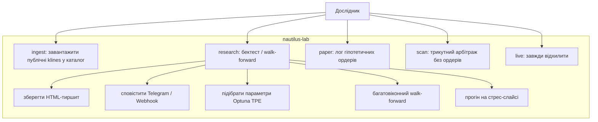

# Use case: що користувач може зробити

Єдиний актор — **дослідник** за CLI `lab`. Живого трейдера немає: `lab live` завжди падає
з `LiveTradingDisabledError`. `lab paper` лише пише гіпотетичні ордери в лог.

## Команди як use cases

| Use case | Команда | Результат | Ордери |
|----------|---------|-----------|--------|
| Завантажити історію | `lab ingest` | Parquet-каталог | немає |
| Чесний звіт OOS | `lab research` | Walk-forward (типово) | лише SIM |
| Повний прогін | `lab research --full-sample` | Один прогін на всій серії | лише SIM |
| Синтетика | `lab research --synthetic` | Демо без мережі | лише SIM |
| Папір | `lab paper` | Лог, без біржі | немає |
| Сканер | `lab scan --triangular` | Цикли Беллмана–Форда | немає |
| Live | `lab live` | Код виходу 1 | ніколи |

Include-зв'язки для `research`:

- обов'язково: `require_simulated_mode` + `require_backtest_support`;
- за прапорцями: `--optuna`, `--folds N`, `--tearsheet`, `--notify`, `--slice`, `--bar-vpin`.

Роботи з адаптером у рушії: `regime`, `ema`, `pairs`, `vpin_momentum`, `formulaic_lgbm`.
Решта (`funding`, `ml_obi`, `glft`, `tri_scan`) — лише доменні блоки; CLI відхиляє їх.
