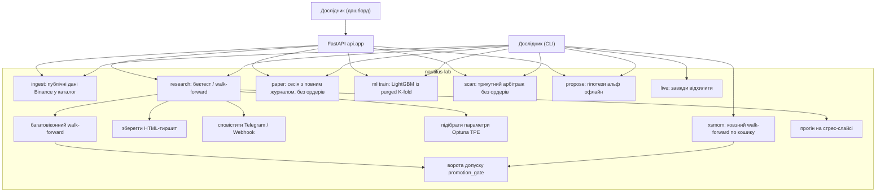

# Use case: що користувач може зробити

Актори — **дослідник** за CLI `lab` і **дослідник у браузері** за веб-дашбордом
(FastAPI + React), який запускає ті самі use cases. Живого трейдера немає: `lab live`
завжди падає з `LiveTradingDisabledError`. `lab paper` проганяє заморожену конфігурацію
вперед і пише повний журнал угод та позицій — але жодного ордера на біржу не надсилає.

## Команди як use cases

| Use case | Команда | Результат | Ордери |
|----------|---------|-----------|--------|
| Завантажити історію | `lab ingest` | Parquet-каталог (бари, тіки, фандинг, стакан) | немає |
| Чесний звіт OOS | `lab research` | Walk-forward (типово) + `promotion_gate` | лише SIM |
| Повний прогін | `lab research --full-sample` | Один прогін на всій серії | лише SIM |
| Синтетика | `lab research --synthetic` | Демо без мережі | лише SIM |
| Paper-сесія | `lab paper` | Повний журнал угод і позицій, без біржі | немає |
| Кошик монет | `lab xsmom` | Ковзний walk-forward + ворота допуску | лише SIM |
| Навчити модель | `lab ml train` | Файл моделі (LightGBM) | немає |
| Сканер | `lab scan --triangular` | Цикли Беллмана–Форда | немає |
| Гіпотези альф | `lab propose` | Артефакт у `research/hypotheses/` | немає |
| Live | `lab live` | Код виходу 1 | ніколи |

Include-зв'язки для `research`:

- обов'язково: `require_simulated_mode` + `require_backtest_support`;
- за прапорцями: `--optuna`, `--folds N`, `--tearsheet`, `--notify`, `--slice`,
  `--bar-vpin` / `--tick-vpin` / `--hawkes`.

Роботи з адаптером у рушії (вісім): `regime`, `ema`, `pairs`, `vpin_momentum`,
`formulaic_lgbm`, `meta_label`, `adaptive_ema`, `ml_obi`. Решта (`funding`, `glft`,
`tri_scan`) — лише доменні блоки; CLI відхиляє їх явно.
