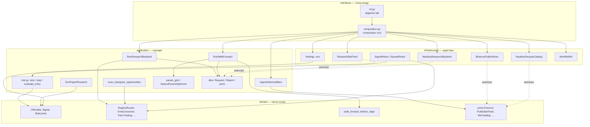
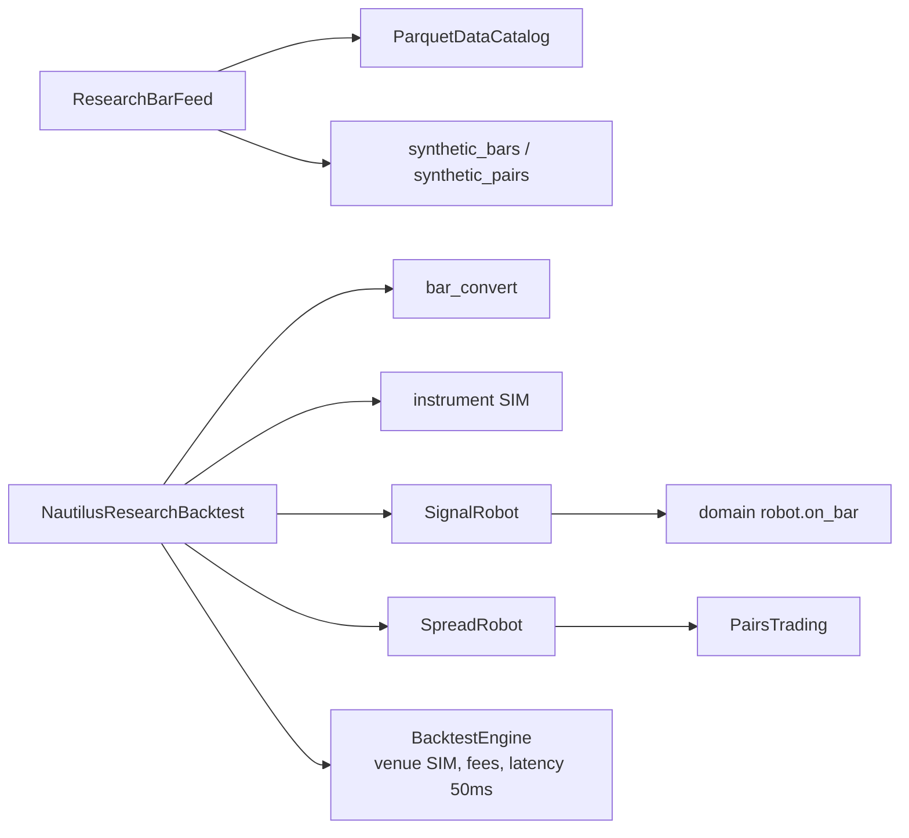

# Package / component: шари й залежності

Правило: **стрілки лише всередину**, до `domain`. Домен не імпортує Nautilus, `.env` і мережу.
Збірка адаптерів — лише в `interfaces/composition.py`.

Суцільні стрілки — виклик / імпорт. Пунктир — реалізація Protocol (adapter).

## Компоненти всередині інфраструктури Nautilus

`SignalRobot` і `SpreadRobot` — тонкі адаптери: нативний `Bar` → `OhlcvBar` → доменний сигнал
→ `evaluate_entry` / `size_position` → `submit_order`. Стратегія не знає лотів.
