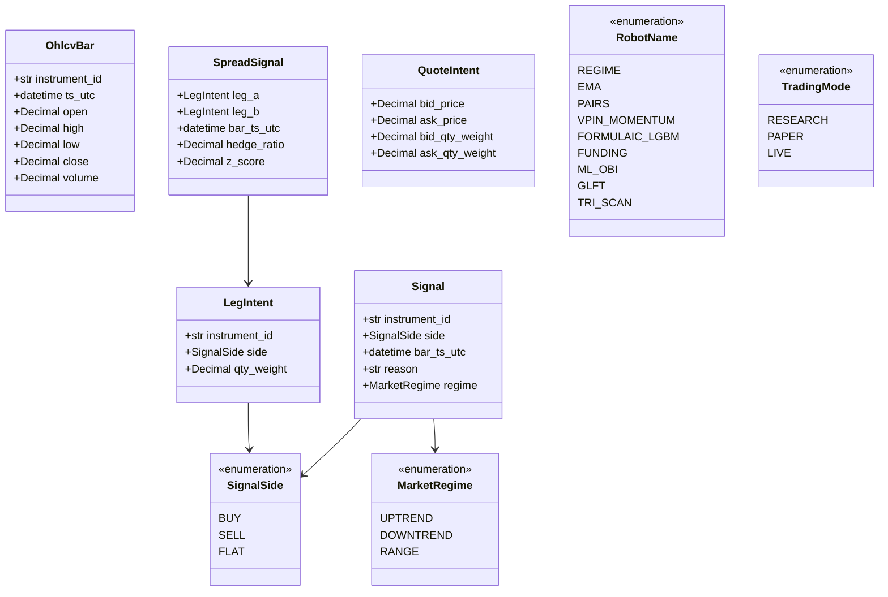
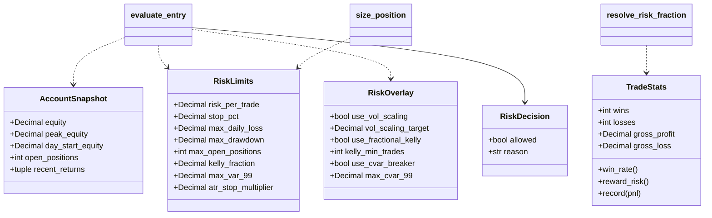
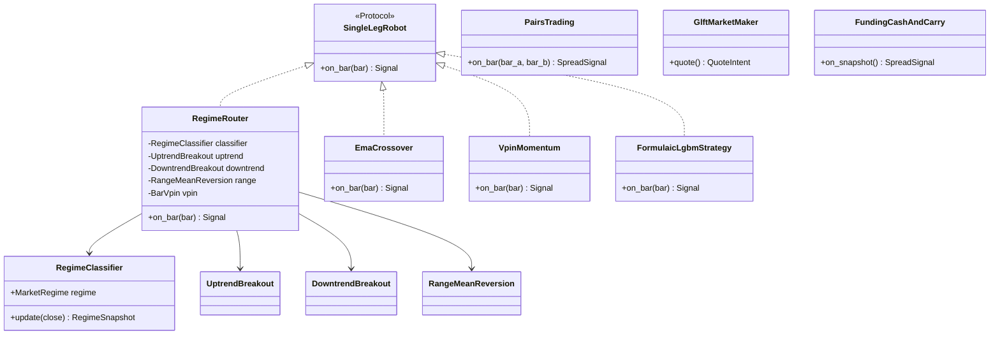
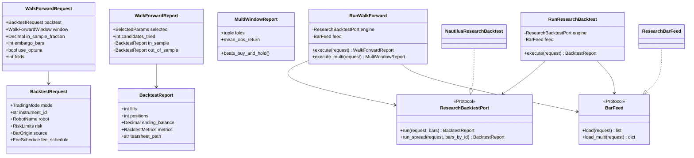
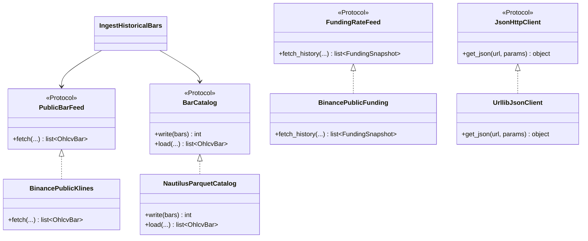

# Class: типи, роботи, порти

Імена збігаються з кодом. Поля — ключові, не вичерпні.

## Доменні значення й наміри

`Signal` / `SpreadSignal` / `QuoteIntent` **не містять розміру в грошах**.
`qty_weight` — відносна вага ноги, не лоти.

## Ризик

`evaluate_entry` / `size_position` живуть у `application/risk.py`; типи лімітів — у `domain/risk.py`.

## Роботи (стратегії сигналів)

Підключені до бектесту (`BACKTEST_WIRED_ROBOTS`): `RegimeRouter`, `EmaCrossover`, `PairsTrading`,
`VpinMomentum`, `FormulaicLgbmStrategy`. `GlftMarketMaker` і `FundingCashAndCarry` — будівельні блоки без адаптера.

## Application DTO і порти

## Порти домену й адаптери даних

