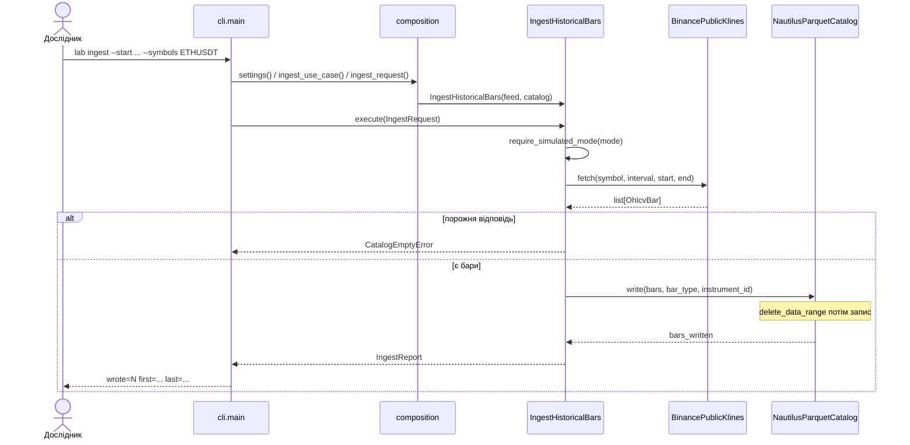
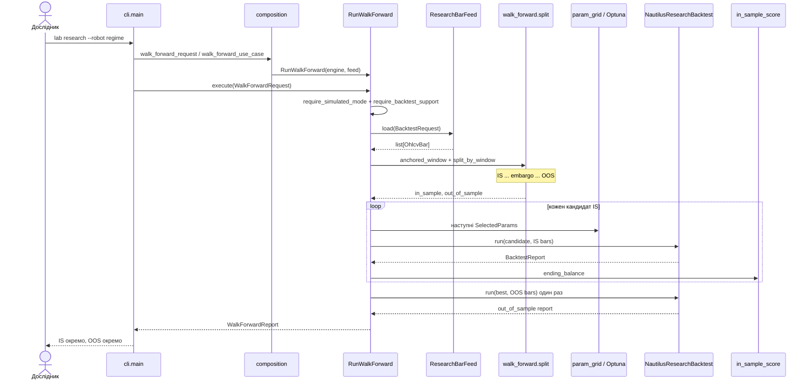
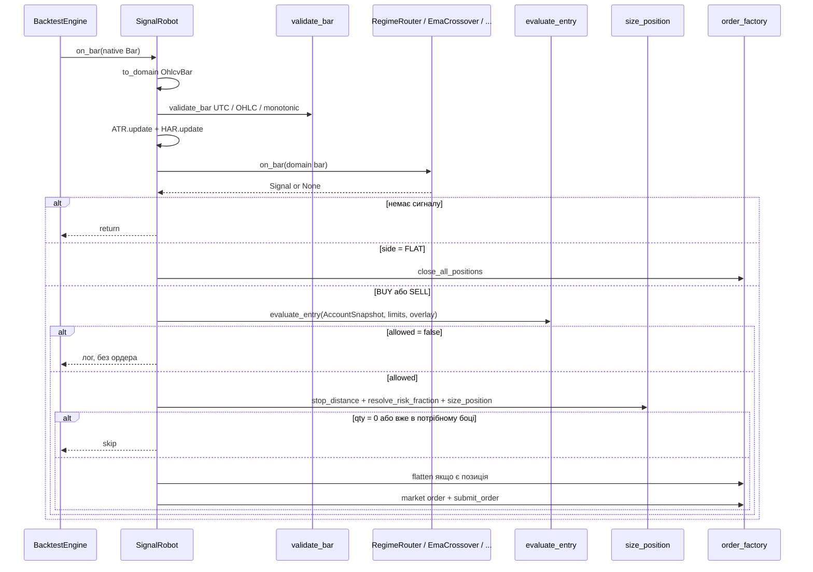
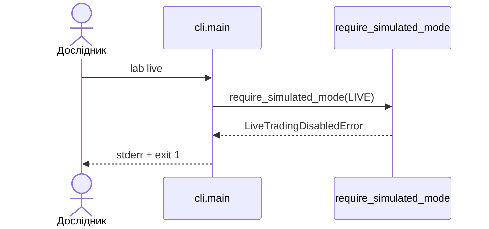

# Sequence: що відбувається в часі

Три головні ланцюги: завантаження даних, walk-forward дослідження, один бар у рушії.

## 1. `lab ingest`

Ключі біржі не потрібні: лише публічний REST `/api/v3/klines`.

## 2. `lab research` (типовий walk-forward)

OOS-бари **ніколи** не потрапляють у цикл підбору. `--folds N` (N ≥ 2) повторює цей цикл
на кожному ковзному вікні й агрегує OOS у `MultiWindowReport`.

Для `pairs` замість `load` / `run` викликаються `load_multi` / `run_spread`.

## 3. Один закритий бар у `SignalRobot`

Fail-closed: немає equity в кеші, `qty == 0`, спрацював circuit breaker — ордера немає.

## 4. `lab live` (негативний сценарій)

Адаптера виконання на біржі в репозиторії немає: навіть виклик use case в обхід CLI
не надішле живий ордер.
