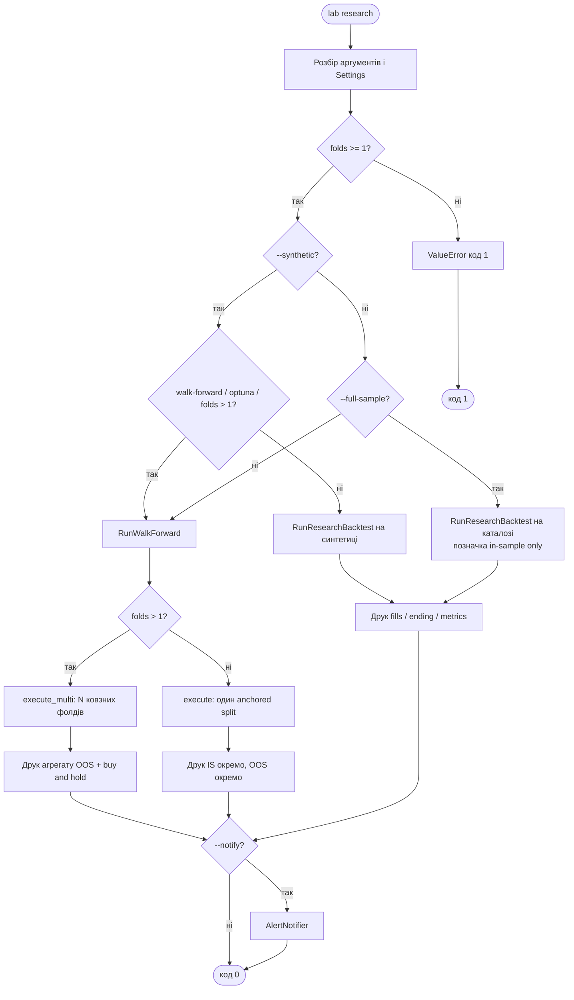
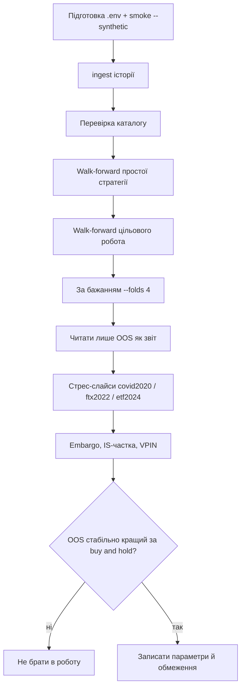
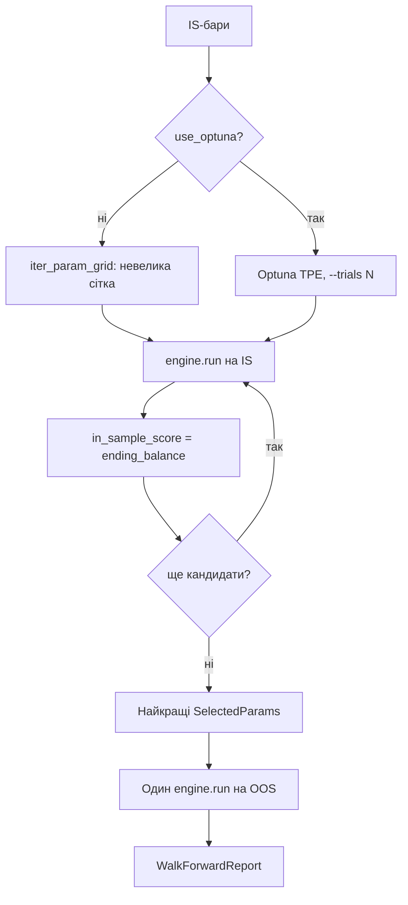

# Activity: розгалуження сценаріїв

## `lab research` від аргументів CLI до звіту

Помилки `LiveTradingDisabledError`, `CatalogEmptyError`, `InvalidWindowError`,
`RobotNotWiredError` / `ValueError` друкуються в stderr і дають код 1.

## Цикл дослідження (методологія)

Відповідає [04-tsykl-doslidzhennya.md](../04-tsykl-doslidzhennya.md).

In-sample баланс — лише для **вибору** параметрів, не для висновку.

## Підбір параметрів на одному вікні

