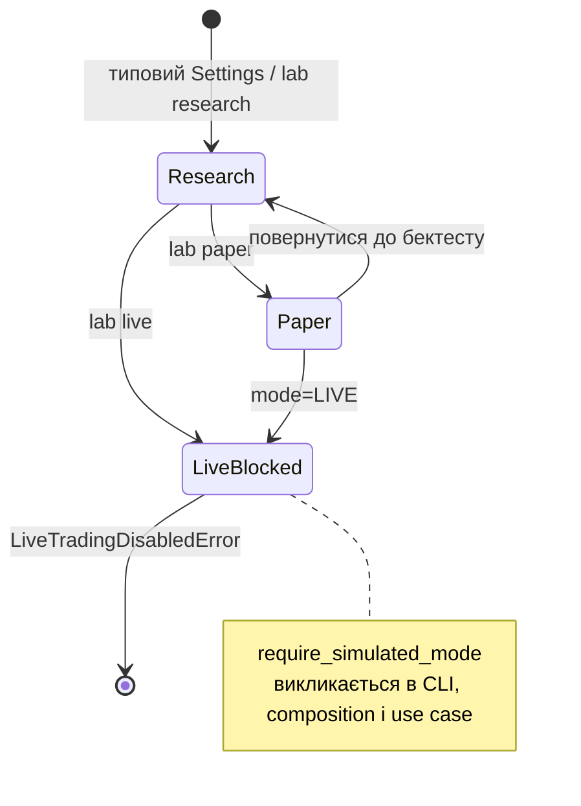
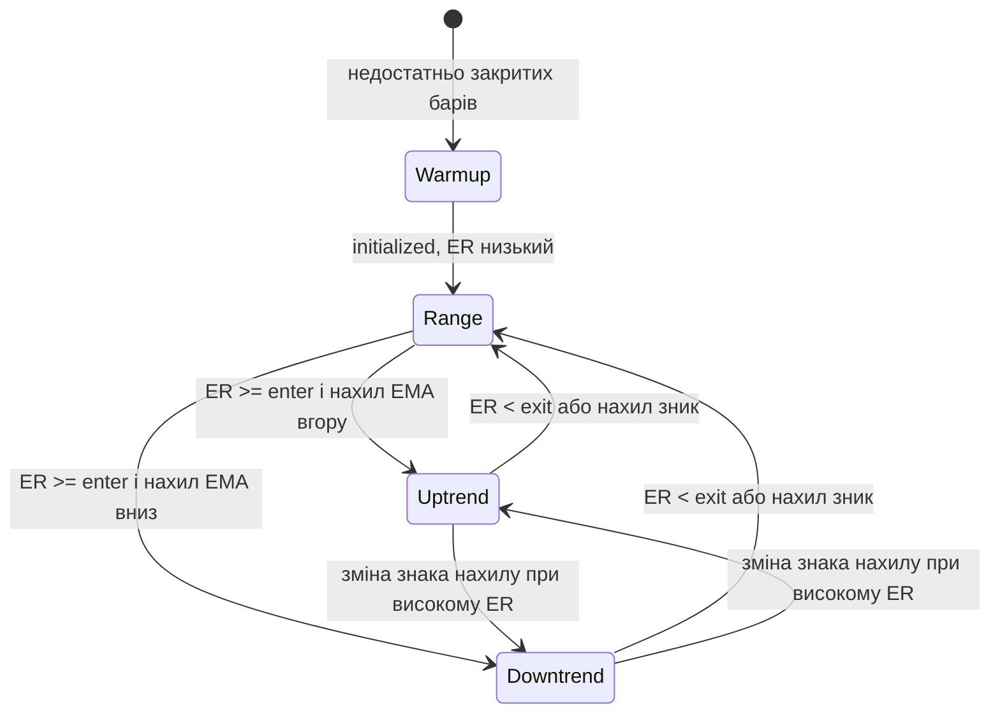
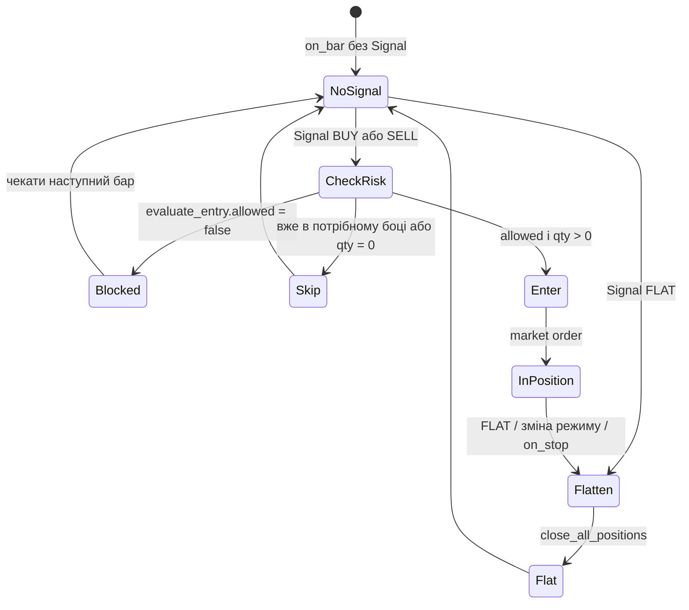

# State: режими процесу, ринку й ризику

## Режим торгівлі процесу

Live ніколи не переходить у виконання: немає адаптера ордерів.

| Стан | Гроші | I/O |
|------|-------|-----|
| RESEARCH | симуляція | історія / синтетика / каталог |
| PAPER | симуляція | лог гіпотетичних ордерів, без біржі |
| LIVE | заборонено | завжди виняток |

## Режим ринку в `RegimeClassifier`

Гістерезис: увійти в тренд важче (`enter_trend_er`), ніж лишитися в ньому (`exit_trend_er`).
Поки індикатори не прогріті, режиму немає.

`RegimeRouter` на **будь-якій** зміні режиму спочатку емітує `SignalSide.FLAT`,
потім на наступних барах торгує стратегією нового режиму:

| Режим | Стратегія |
|-------|-----------|
| UPTREND | Donchian breakout long |
| DOWNTREND | Donchian breakout short |
| RANGE | Bollinger mean reversion |

Опційний `--bar-vpin`: токсичний VPIN може змістити ефективний режим (флет з нахилом → тренд).

## Рішення про вхід

Не повний автомат позиції Nautilus, а логіка **до** ордера в адаптері.

Circuit breakers у `evaluate_entry`: денний збиток, максимальна просадка, ліміт позицій,
VaR 99%, опційно CVaR. Flattening — обов'язок адаптера, не стратегії.
