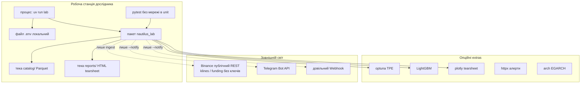
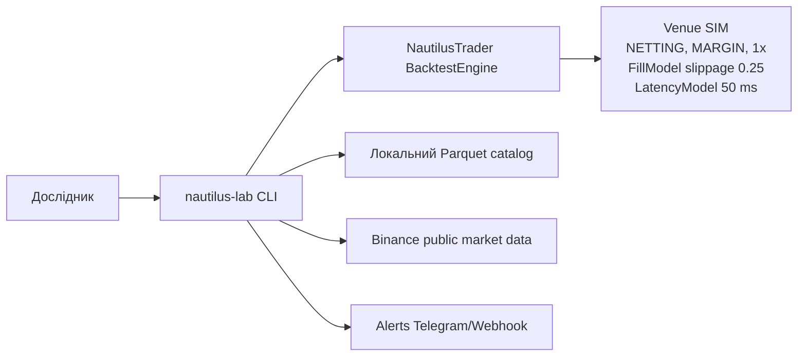

# Deployment / context: що крутиться і куди ходить дані

Це **локальна дослідницька пісочниця**, не торговий кластер. Немає WebSocket, колокації
і live-брокера.

Пунктир — мережа. Типовий `lab research` після ingest **не ходить в інтернет**: читає каталог.

## Контекст системи (C4-подібний)

Інструменти симуляції: `ETH/USDT.SIM`, `BTC/USDT.SIM`, `ETHUSDT-PERP.SIM`.

## Потік даних (pipeline)

```mermaid
flowchart LR
    kline["Binance kline JSON"] --> parse["parse_binance_kline"]
    parse --> bar["OhlcvBar Decimal UTC"]
    bar --> validate["validate_bar"]
    validate --> parquet["ParquetDataCatalog"]
    parquet --> feed["ResearchBarFeed.load"]
    synth["synthetic_ohlcv"] --> feed
    feed --> convert["to_engine_bars"]
    convert --> engine["BacktestEngine"]
    engine --> native["нативний Bar"]
    native --> adapter["SignalRobot / SpreadRobot"]
    adapter --> domainBar["знову OhlcvBar"]
    domainBar --> signal["Signal / SpreadSignal"]
    signal --> risk["risk size + breakers"]
    risk --> order["Market order SIM"]
    order --> fills["fills / positions"]
    fills --> metrics["compute_metrics"]
    metrics --> report["BacktestReport / консоль / tearsheet"]
```

Гроші скрізь `Decimal`. Індикатори бачать лише **закритий** бар (`RollingWindow.prior()`),
щоб не було look-ahead.

## Щого немає в деплої (навмисно)

- ключів API біржі в git / обов'язковому `.env`;
- процесу live-виконання;
- спільної БД — стан дослідження в каталозі й звітах;
- окремого API-сервера — лише CLI `lab`.
