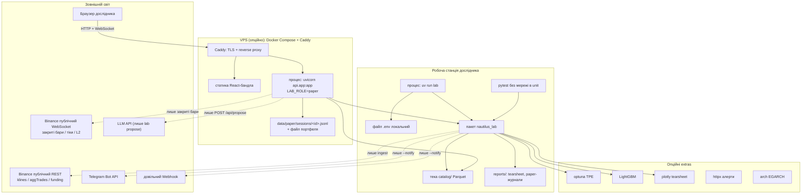
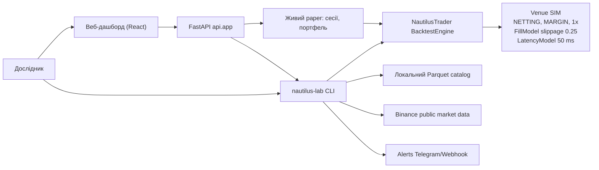

# Deployment / context: що крутиться і куди ходить дані

Це **дослідницька пісочниця**, не торговий кластер. Немає колокації і live-брокера:
адаптера виконання не існує, `lab live` завжди fail closed.

Два способи працювати з одним і тим самим кодом: CLI `lab` на робочій станції і
веб-дашборд (FastAPI + React), який запускає ті самі use cases. Другий зазвичай живе
на VPS, де тримають живий paper-термінал 24/7 ([26-deploy-vps.md](../26-deploy-vps.md)).

Пунктир — мережа. Типовий `lab research` після ingest **не ходить в інтернет**: читає каталог.
WebSocket тут **лише читає публічні потоки** — ордерів через нього не надсилають.

## Контекст системи (C4-подібний)

Інструменти симуляції: `ETH/USDT.SIM`, `BTC/USDT.SIM`, `ETHUSDT-PERP.SIM`.
Живий paper використовує той самий рушій і ту саму модель філів, що й бектест, але
рахунок віртуальний — див. [24-paper-treydynh.md](../24-paper-treydynh.md).

## Потік даних (pipeline)

```mermaid
flowchart LR
    kline["Binance kline JSON"] --> parse["parse_binance_kline"]
    parse --> bar["OhlcvBar Decimal UTC"]
    bar --> validate["validate_bar"]
    validate --> parquet["ParquetDataCatalog"]
    parquet --> feed["ResearchBarFeed.load"]
    synth["synthetic_ohlcv"] --> feed
    feed --> convert["to_engine_bars"]
    convert --> engine["BacktestEngine"]
    engine --> native["нативний Bar"]
    native --> adapter["SignalRobot / SpreadRobot"]
    adapter --> domainBar["знову OhlcvBar"]
    domainBar --> signal["Signal / SpreadSignal"]
    signal --> risk["risk size + breakers"]
    risk --> order["Market order SIM"]
    order --> fills["fills / positions"]
    fills --> metrics["compute_metrics"]
    metrics --> report["BacktestReport / консоль / tearsheet"]
```

Гроші скрізь `Decimal`. Індикатори бачать лише **закритий** бар (`RollingWindow.prior()`),
щоб не було look-ahead.

## Чого немає в деплої (навмисно)

- ключів API біржі в git / обов'язковому `.env`;
- процесу live-виконання й адаптера виконання;
- спільної БД — стан дослідження в каталозі, звітах і JSONL-журналах сесій;
- другого рушія для paper: і бектест, і живий paper ідуть через той самий
  Nautilus `BacktestEngine`;
- автоматичного деплою — CI перевіряє якість (`.github/workflows/ci.yml`), а вивантаження
  на VPS завжди ручне (`scripts/deploy_vps.sh`, `scripts/pull_vps.sh`).

Що **є**, але легко пропустити: окремий API-сервер (`uvicorn nautilus_lab.api.app:app`),
публічні WebSocket-потоки лише для читання даних, і роль `LAB_ROLE=paper`, яка на
розгорнутому сервері забороняє все, крім керування живими paper-сесіями
(`api/security.py`, `PAPER_ROLE_WRITES`).
