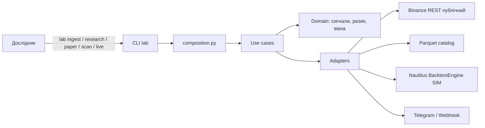

# UML-діаграми nautilus-lab

Візуальна карта застосунку: **що можна зробити**, **як шари залежать один від одного**,
**які типи живуть у домені**, і **що відбувається в часі** під час `lab ingest` / `lab research`.

Діаграми синхронізовані з кодом (чиста архітектура: `interfaces` → `application` → `domain`,
адаптери в `infrastructure`). Текстовий опис тих самих ідей — [03-arhitektura.md](../03-arhitektura.md)
і [12-karta-fayliv.md](../12-karta-fayliv.md).

Перегляд: GitHub, GitLab, VS Code / Cursor (розширення Mermaid) або [mermaid.live](https://mermaid.live).

## Зміст

| Файл | Тип UML | На що дивитися |
|------|---------|----------------|
| [01-use-case.md](01-use-case.md) | Use case | Команди CLI і актори; live завжди fail-closed |
| [02-package-component.md](02-package-component.md) | Package / component | Чотири шари, правило залежностей, composition root |
| [03-class.md](03-class.md) | Class | Доменні типи, роботи, порти й адаптери |
| [04-sequence.md](04-sequence.md) | Sequence | Ingest, walk-forward, обробка одного бару |
| [05-activity.md](05-activity.md) | Activity | Розгалуження `lab research` і цикл дослідження |
| [06-state.md](06-state.md) | State | `TradingMode`, режим ринку, рішення ризику |
| [07-deployment.md](07-deployment.md) | Deployment / context | Процес, файли, мережа; живого брокера немає |

## Одна картинка для старту

Головне правило проєкту: стратегія каже лише *купити / продати / вийти*.
Розмір позиції і «чи можна входити» рахує ризик-сервіс. Живих ордерів немає.
