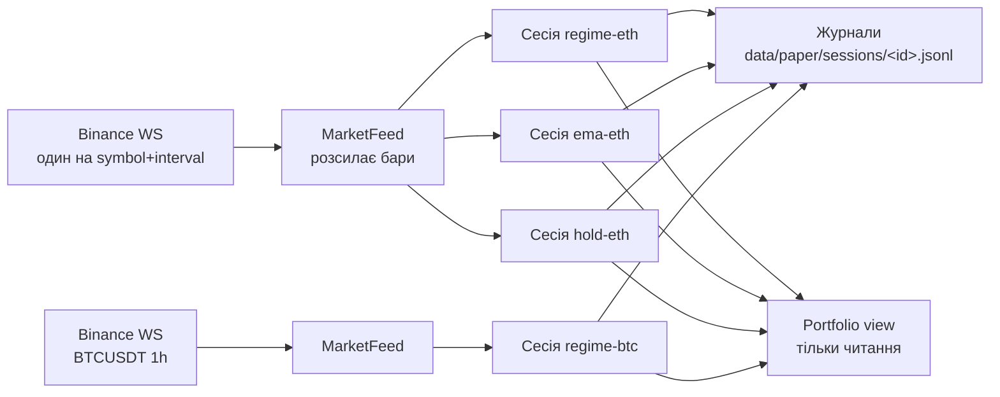

# План: багатороботний paper-термінал

Sep 24, 2026 · @Volodymyr

Пропоную замінити одну глобальну сесію на менеджер із 3–5 незалежних сесій, у кожної з яких власний робот, журнал і віртуальний рахунок. Над ними — екран «Портфель», де всі роботи видно однією таблицею. Порядок: спершу бекенд (без нього UI немає що показувати), потім портфель і термінал сесії, далі порівняння й сповіщення.

Чому саме так:

- **Окремий рахунок у кожного робота.** Інакше два роботи ділили б один баланс і одні запобіжники, і збиток одного блокував би іншого. На етапі дослідження кожен робот — окрема гіпотеза.
- **Портфельний ризик — лише спостереження.** Сумарна equity, кореляція й перетин позицій показуються, але не блокують угод. Це стане обмеженням тільки тоді, коли роботи торгуватимуть спільним капіталом.
- **Один процес, одне WS-підключення на пару символ+інтервал.** Два роботи на ETH 1h читають одні й ті самі бари. Це економить ліміти Binance і гарантує, що порівняння чесне.

Загальний обсяг — приблизно 6–9 робочих днів у трьох етапах (див. «Етапи»). Перший етап уже дає кілька роботів на VPS і базовий огляд у дашборді.

## Як обрати роботів

На paper варто запускати лише тих роботів, чий результат щось доведе або спростує, і завжди разом із контрольною сесією buy & hold. Станом на аудит 2026-09-23 жоден робот не пройшов усі ворота, тож зараз paper перевіряє гіпотези, а не підтверджує готову стратегію.

Ворота допуску на paper (з docs/21 §10 і docs/25):

| Критерій | Поріг | Де дивитися |
| --- | --- | --- |
| Результат OOS проти buy & hold | середній і медіанний OOS вище за buy & hold | `lab research --folds 4` |
| Перенавчання | PBO < 0.25 | `lab research --pbo` |
| Статистична значущість | DSR p < 0.05 і Sharpe переможця > 0 | той самий звіт PBO |
| Стійкість до комісій | поріг беззбитковості (breakeven) вище за сплачені 10 б.п. | блок breakeven у звіті |
| Статус у специфікації | не `rejected` | `specs/strategies/*.yaml` |
| Живий термінал вміє того самого робота | ті самі параметри, що в research | `LIVE_PAPER_ROBOTS` у `paper_streamer.py` |

Рекомендований стартовий набір (4 сесії, по 10 000 кожна):

| Сесія | Робот | Ринок | Роль | Чому |
| --- | --- | --- | --- | --- |
| `regime-eth` | `regime` | ETHUSDT 1h | основна гіпотеза | єдиний з плюсом OOS (+0.20%) і PBO 0.043; але breakeven 7.96 б.п. нижче за комісії |
| `regime-btc` | `regime` | BTCUSDT 1h | перевірка узагальнення | ті самі параметри на іншому інструменті |
| `ema-eth` | `ema` | ETHUSDT 1h | негативний контроль | відомо слабкий (OOS −5.6%); якщо він «виграє» в paper, перевіряти треба сам paper |
| `hold-eth` | `hold` (новий) | ETHUSDT 1h | бенчмарк | купити на старті й тримати; без нього результати нема з чим порівнювати |

Поки не запускати:

- `vpin_momentum` — на барах 1h поріг 0.7 недосяжний, 0 угод.
- `formulaic_lgbm` — живий термінал підставляє евристичний класифікатор замість навченої моделі.
- `adaptive_ema` — у специфікації статус `rejected`.
- `meta_label`, `pairs`, `ml_obi` — живий термінал їх ще не вміє. `meta_label` (+6.5% у paper, але PBO 0.97) додаємо на етапі 3.

Перед запуском записуйте в конфігурацію сесії гіпотезу й критерій зупинки (див. бекенд, поле `notes`). Наприклад: «`regime-eth` за 60 днів обжене `hold-eth` після комісій; інакше гіпотезу відхилено».

## Бекенд: кілька сесій в одному процесі

Замість глобального `LIVE_PAPER_SESSION` з'являється `SessionRegistry` — словник `session_id → LivePaperSessionManager`. Сам менеджер сесії ймовірно залишиться майже без змін.

Кожна сесія торгує зі свого рахунку і пише свій журнал. Портфель лише читає їхні стани.

Зміни:

1. **`MarketFeed` окремо від сесії.** Зараз сесія сама відкриває WebSocket. Це виносимо в окремий клас, який один раз слухає `symbol@kline_interval`, один раз робить розігрів з REST і викликає `process_kline_update` у всіх підписаних сесій. Коли остання сесія відписується, сокет закривається.
2. **Журнал на сесію.** `data/paper/sessions/<session_id>.jsonl`. Формат подій лишається нинішнім. При старті реєстр відновлює **всі** незавершені сесії. Існуючий `live_events.jsonl` читається один раз для міграції: запущена зараз сесія не губиться.
3. **Назва і нотатки в конфігурації.** Додаються поля `name` (`regime-eth`), `notes` (гіпотеза і критерій зупинки) і `created_from` (`ui`, `portfolio file`, `autostart`). Усе це записується в `session_start`.
4. **Робот `hold`.** Купує на першому закритому барі всей капітал з урахуванням комісії і тримає без стопа. Це бенчмарк для сесій на тому ж символі.
5. **Ліміти.** `LIVE_PAPER_MAX_SESSIONS=8`, не більше 5 унікальних пар symbol+interval. Перевищення → 400 з поясненням, без тихого ігнорування.
6. **Скидання запобіжника max drawdown з часом (опція).** Так само, як `DRAWDOWN_COOLDOWN_DAYS` у бектесті. За замовчуванням вимкнено, щоб не змінювати нинішню поведінку.

API (старі `/api/paper/live/*` лишаються аліасами на першу сесію на один реліз):

| Метод і шлях | Дія |
| --- | --- |
| `GET /api/paper/sessions` | список: id, name, robot, symbol, interval, active, equity, return, позиція, last\_bar, risk\_refusals |
| `POST /api/paper/sessions` | створити й запустити (тіло як у нинішнього start + name, notes) |
| `GET /api/paper/sessions/{id}` | повний стан однієї сесії |
| `POST /api/paper/sessions/{id}/stop` · `/close-position` · `/update-stops` | керування однією сесією |
| `POST /api/paper/sessions/{id}/pause` · `/resume` | пауза нових входів; індикатори працюють, виходи та стопи — теж |
| `GET /api/paper/portfolio` | сумарна equity, перетин позицій за символами, кореляція доходностей сесій |
| `WS /api/paper/stream?session=<id>\|all` | потік однієї сесії або короткі оновлення всіх для портфеля |

Роль `LAB_ROLE=paper` дозволяє саме ці шляхи; список у `security.py` оновиться разом із тестом.

## Інтерфейс: портфель → сесія

Вкладка Trading Terminal стає дворівневою: спершу таблиця всіх роботів, клік по рядку відкриває термінал однієї сесії. На першому екрані має бути відповідь на питання «чи все працює і хто виграє в бенчмарку».

### 1. Екран «Портфель»

- **Верхній рядок:** сумарна equity, дохідність портфеля, скільки сесій активні/на паузі/з помилкою, статус потоків даних (зелений, якщо останній бар свіжий).
- **Таблиця сесій**, один рядок на робота:

| Колонка | Зміст |
| --- | --- |
| Сесія | назва, робот, symbol · interval |
| Статус | активна / пауза / зупинена / запобіжник / немає даних |
| Equity і дохідність | з урахуванням нереалізованого PnL |
| vs benchmark | різниця з `hold` на тому ж символі, в відсоткових пунктах |
| Позиція | LONG/SHORT/flat, PnL, відстань до SL |
| Угоди | закриті / виграшні, комісії |
| Max DD | за кривою equity сесії |
| Міні-графік | крива equity за 7 днів |
| Дії | відкрити · пауза · закрити позицію · зупинити (з підтвердженням) |

- **Спільний графік equity**: усі сесії, нормовані до 100 на старті, бенчмарк — пунктиром.
- **Панель експозиції**: сумарний напрямок за символами (наприклад, «ETH: 2 long, 1 flat») і попередження, коли всі роботи в одному напрямку.
- **Стрічка подій**: останні 20 подій усіх сесій (угоди, спрацювання запобіжників, відновлення після рестарту, обриви потоку).

### 2. Екран сесії

Це нинішній термінал, але прив'язаний до `session_id`, з додатками:

- маркери входів і виходів на свічках (стрілки з причиною виходу);
- крива equity під графіком ціни зі спільною віссю часу;
- блок «Стан робота»: режим (trend/range), останній сигнал, скільки входів відхилив ризик і чому;
- блок «Гіпотеза»: `notes` із конфігурації, день N із запланованих, прогрес до 30 закритих угод;
- таблиця угод з фільтром за причиною та експортом у CSV.

### 3. Майстер «Нова сесія»

Три кроки замість нинішньої форми:

1. **Робот.** Картки роботів із вердиктом останнього аудиту (OOS, PBO, DSR, breakeven і статус у специфікації). Роботи зі статусом `rejected` або без угод позначені сірим і вимагають підтвердження.
2. **Ринок і ризик.** Symbol, interval, капітал, risk/stop/TP. За замовчуванням — значення з `.env` (ті, що в research); відхилення підсвічується.
3. **Гіпотеза.** Назва, очікування, тривалість і критерій зупинки. Прапорець «Додати hold-бенчмарк» увімкнений, якщо на цьому символі його ще немає.

### 4. Екран «Порівняння»

Дві–чотири сесії поруч, включно зі зупиненими з журналу:

- equity, max DD, кількість угод, win rate, частка комісій у PnL, середній час утримання;
- **paper проти research**: ті самі метрики з останнього бектесту цього робота (`reports/history`). Розбіжність показує, наскільки бектест оптимістичний.

## Швидкі покращення поточного терміналу

Це можна зробити до багатосесійності, за 1–2 дні, і все це залишиться в екрані сесії. Перший пункт уже зроблено.

| # | Зміна | Навіщо |
| --- | --- | --- |
| 1 | Заголовок і форма показують конфігурацію запущеної сесії (**зроблено**, чекає деплою) | не було видно, що реально торгується |
| 2 | Зрозуміла причина «Disconnected»: після відмови на рівні origin/token показати текст причини й підказку | сьогодні порт 8087 замість 8080 виглядав як збій сервера |
| 3 | Індикатор «останній закритий бар N хв тому» і «наступний через M хв» | на 1h довга тиша — норма, і це має бути видно |
| 4 | Стан робота: режим, останній сигнал, `risk_refusals` у `to_state_dict()` | зараз відмови ризику видно лише в журналі |
| 5 | Бейдж «resumed at …» і подія «While offline: …» у стрічці | деплої й ребути мають бути видими в історії сесії |
| 6 | Маркери угод на графіку (lightweight-charts `setMarkers`) | входи та виходи не доведеться шукати в таблиці |
| 7 | Історія свічок до 500 барів із розігріву, а не лише з моменту старту | після рестарту графік сьогодні порожній (як на скриншоті) |
| 8 | Підтвердження перед Stop з поясненням, що це остаточно | невипадкове завершення прогону на тиждень |
| 9 | Сховати на paper-сервері недоступні вкладки (Research, Batch Replay, ML) або показувати їх сірими | менше 403 і плутанини |
| 10 | Прибрати перемикач «Live Trading» або підписати його «не підключено» | реальної торгівлі в коді немає, кнопка вводить в оману |
